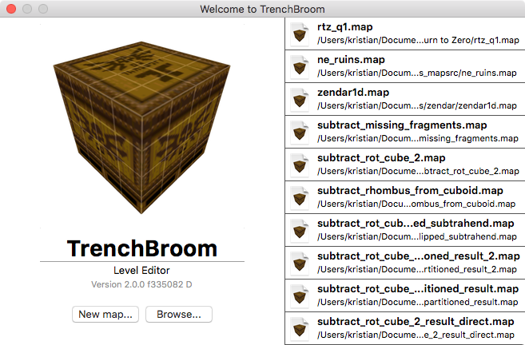

% TrenchBroom Documentation
% Kristian Duske
% 11-13-2015

# Introduction {#introduction}

TrenchBroom is a level editing program for brush-based game engines such as Quake, Quake 2, and Hexen 2. TrenchBroom is easy to use and provides many simple and advanced tools to create complex and interesting levels with ease. This document contains the documentation for TrenchBroom. Reading this document will teach you how to use TrenchBroom and how to use its advanced features.

## Features {#features}

* **General**
	- Full support for editing in 3D and in up to three 2D views
	- High performance renderer with support for huge maps
	- Unlimited Undo and Redo
	- Macro-like command repetition
	- Point file support
	- Automatic backups
	- Free and cross platform
	- Issue browser with automatic quick fixes
* **Brush Editing**
	- Robust vertex editing with edge and face splitting
	- Clipping tool with two and three points
	- CSG operations: merge, subtract, intersect, partition
	- UV view for easy texture manipulations
	- Precise texture lock for all brush editing operations
* **Entity Editing**
	- Entity browser with drag and drop support
	- Entity link visualization
	- Displays 3D models in the editor
	- Smart Entity Property Editors

# Getting Started {#getting_started}

In this section, we introduce the startup window, the game configuration to setup TrenchBroom to work with your games, we give an overview of the main window and explain the camera navigation in the 3D and 2D views. Press action #action('Controls/Map view/Duplicate and move objects up; Duplicate and move objects forward') to activate this or select #menu('Menu/Edit/Show All')!

## Startup {#startup}

The first thing you will see when TrenchBroom starts is the welcome window. This window allows you to open one of your most recently edited maps, to create a new map or to browse your computer for an existing map you wish to open in TrenchBroom.

You can click the button labelled "New map..." to create a new map or you can click the button labelled "Browse..." to find a map file on your computer. Double click one of the documents in the list on the right of the window to open it. The light gray text on the left gives you some information about which version of TrenchBroom you are currently running. The version information is useful if you wish to report a problem with the editor (see [here](#reporting_bugs) for more information).

## Game Configuration {#game_configuration}

## Main Window {#main_window}

## Camera Navigation {#camera_navigation}

# Selection {#selection}

# Editing

## Creating Objects

### Creating Simple Brushes

### Creating Complex Brushes

### Creating Entities

### Duplicating Objects

## Editing Objects

## Deleting Objects

## Transforming Objects

## Working with Textures

## Shaping brushes

### Clipping Tool

### Vertex Editing

### CSG Operations

## Entity Properties

## Keeping an Overview

## Undo and Redo

# Advanced Topics

## Command Repetition

## Issue Browser

## Solving Problems

## Display Models for Entities

## Customization

# Getting Involved

## Reporting Bugs {#reporting_bugs}

### The Version Information

Open the "About TrenchBroom" dialog from the menu. The light gray text on the left gives you some information about which version of TrenchBroom you are currently running, for example "Version 2.0.0 f335082 D". The first three numbers represent the version (2.0.0), the following seven letter string is the build id (f335082), and the final letter indicates the build type ("D" for Debug and "R" for release). You can also find this information in the Welcome window that the editor shows at startup.
