% TrenchBroom  \_\_TB_VERSION\_\_ Reference Manual
% Kristian Duske
% 11-13-2015

# Introduction {#introduction}

TrenchBroom is a level editing program for brush-based game engines such as Quake, Quake 2, and Hexen 2. TrenchBroom is easy to use and provides many simple and advanced tools to create complex and interesting levels with ease. This document contains the manual for TrenchBroom. Reading this document will teach you how to use TrenchBroom and how to use its advanced features.

## Features {#features}

* **General**
  - Full support for editing in 3D and in up to three 2D views
  - High performance renderer with support for huge maps
  - Unlimited Undo and Redo
  - Macro-like command repetition
  - Linked groups
  - Issue browser with automatic quick fixes
  - Run external compilers and launch game engines
  - Point file support
  - Portal file support
  - Automatic backups
  - Free and cross platform
* **Brush Editing**
  - Robust vertex editing with edge and face splitting and manipulating multiple vertices together
  - Clipping tool with two and three points
  - Scale and shear tools
  - CSG operations: merge, subtract, hollow
  - UV view for easy texturing manipulations
  - Precise alignment lock for all brush editing operations
  - Multiple material collections
* **Entity Editing**
  - Entity browser with drag and drop support
  - Support for FGD, ENT and DEF files for entity definitions
  - Mod support
  - Entity link visualization
  - Displays 3D models in the editor (supports mdl, md2, md3, bsp, dkm)
  - Smart entity property editors

## About this Document

This document is intended to help you learn to use the TrenchBroom editor. It is not intended to teach you how to map, and it isn't a tutorial either. If you are having technical problems with your maps, or need information on how to create particular effects or setups for the particular game you are mapping for, you should ask other mappers for help (see [References and Links](#references_and_links) to find mapping communities and such). This document will only teach you how to use this editor.

# Getting Started {#getting_started}

This section starts off with a small introduction to the most important technical terms related to mapping for brush-based engines. Additionally, we introduce some concepts on which TrenchBroom is built. Afterwards, we introduce the welcome window, the game selection dialog, we give an overview of the main window and explain the camera navigation in the 3D and 2D views.

## Preliminaries {#preliminaries}

In this section we introduce some technical terms related to mapping in Quake-engine based games. It is not important that you understand every detail of all of these terms, but in order to understand how TrenchBroom works, you should have a general idea how maps are structured and how TrenchBroom views and manages that structure. In particular, this section introduces some concepts that we added to the map structures (without changing the file format, of course). Knowing and understanding these concepts will help you to get a grip on several important aspects of editing levels in TrenchBroom.

### Map Definitions

In Quake-engine based games, levels are usually called maps. The following simple specification of the structure of a map is written in extended Backus-Naur-Form (EBNF), a simple syntax to define hierarchical structures that is widely used in computer science to define the syntax of computer languages. Don't worry, you don't have to understand EBNF as we will explain the definitions line by line.

    1. `Map      = Entity {Entity}`
    2. `Entity   = {Property} {Brush}`
    3. `Property = Key Value`
    4. `Brush    = {Face}`
    5. `Face     = Plane Texture Offset Scale Rotation ...`

The first line specifies that a **map** contains an entity followed by zero or more entities. In EBNF, the braces surrounding the word "Entity" indicate that it stands for a possibly empty sequence of entities. Altogether, line one means that a map is just a sequence of one or more entities. An **entity** is a possibly empty sequence of properties followed by zero or more brushes. A **property** is just a key-value pair, and both the key and the value are strings (this information was omitted from the EBNF).

Line four defines a **Brush** as a possibly empty sequence of faces (but usually it will have at least four, otherwise the brush would be invalid). And in line five, we finally define that a **Face** has a plane, a material, the X and Y offsets and scales, the rotation angle, and possibly other attributes depending on the game.

In this document, we use the term _object_ to refer to entities and brushes.

### TrenchBroom's View of Maps

TrenchBroom organizes the objects of a map a bit differently than how they are organized in the map files. Firstly, TrenchBroom introduces two additional concepts: [Layers](#layers) and [Groups](#groups). Secondly, the worldspawn entity is hidden from you and its properties are associated with the map. To differentiate TrenchBroom's view from the view that other tools and compilers have, we use the term "world" instead of "map" here. In the remainder of this document, we will use the term "map" again.

    1. `World        = {Property} DefaultLayer {Layer}`
    2. `DefaultLayer = Layer`
    3. `Layer        = Name {Group} {Entity} {Brush}`
    4. `Group        = Name {Group} {Entity} {Brush}`

The first line defines the structure of a map as TrenchBroom sees it. To TrenchBroom, a **World** consists of zero or more properties, a default layer, and zero or more additional layers. The second line specifies that the **DefaultLayer** is just a layer. Then, the third line defines what a **Layer** is: A layer has a name (just a string), and it contains zero or more groups, zero or more entities, and zero or more brushes. In TrenchBroom, layers are used to partition a map into several large areas in order to reduce visual clutter by hiding them. In contrast, groups are used to merge a small number of objects into one object so that they can all be edited as one. Like layers, a **Group** is composed of a name, zero or more groups, zero or more entities, and zero or more brushes. In case you didn't notice, groups induce a hierarchy, that is, a group can contain other sub-groups. All other definitions are exactly the same as in the previous section.

To summarize, TrenchBroom sees a map as a hierarchy (a tree). The root of the hierarchy is called world and represents the entire map. The world consists first of layers, then groups, entities, and brushes, whereby groups can contain more groups, entities, and brushes, and entities can again contain brushes. Because groups can contain other groups, the hierarchy can be arbitrarily deep, although in practice groups will rarely contain more than one additional level of sub groups.

### Brush Geometry {#brush_geometry}

In standard map files, the geometry of a brush is defined by a set of faces. Apart from the attributes defining the UV mapping, a face also specifies a plane using three plane points. The plane is oriented by the order in which the three points are written in the face specification in the map file. Here is an example:

    ( 32 32 -3824  ) ( -32 32 -3824  ) ( -32 96 -3824 ) mmetal1_2 0 0 0 1 1

The plane points are given as three groups of three numbers. Each group is made up of three numbers that specify the X,Y and Z coordinates of the respective plane point. The three points, p1, p2 and p3, define two vectors, v1 and v2, as follows:

      *p2
     /|\
      |
      v2
      |
    p1*--v1--->*p3

The normal of the plane is in the direction of the cross product of v1 and v2. In the diagram above, the plane normal points towards you. Together with its normal, the plane divides three dimensional space into two half spaces: The upper half space above the plane, and the lower half space below the plane. In this interpretation, the volume of the brush is the intersection of the lower half spaces defined by the face planes. This way of defining brushes has the advantage that all brushes are automatically convex. However, this representation of brushes does not directly contain any other geometric information of the brush, particularly its vertices, edges, and facets, which must be computed from the plane representation. In TrenchBroom, the vertices, edges, and facets are called the **brush geometry**. TrenchBroom uses the same method as the BSP compilers to compute the brush geometry. Having the brush geometry is necessary mainly for two things: Rendering and vertex editing.

### Entity Definitions {#entity_definitions}

To TrenchBroom, entities are just a sequence of properties (key value pairs), most of which are without any special meaning. In particular, the entity properties do not specify which model TrenchBroom should display for the entity in its viewports. Additionally, some property values have specific types, such as color, angle, or position. But these types cannot be hardcoded into the editor, because depending on the game, mod, or entity, a property called "angle" may have a different meaning. To give TrenchBroom more information on how to interpret a particular entity and its properties, an entity definition is necessary. Entity definitions specify the spawnflags of an entity, the names and types of its properties, the model to display in the editor, and other things. They are usually specified in a separate file that you can [load into the editor](#entity_definition_setup).

### Mods {#mods}

A mod (short for game modification) is a way of extending a Quake-engine based game with custom gameplay and assets. Custom assets include models, sounds, and materials. From the perspective of the game, a mod is a subdirectory in the game directory where the additional assets reside in the form of loose files or archives such as pak files. As far as TrenchBroom is concerned, a mod just provides assets, some of which replace existing assets from the game and some of which are new. For example, a mod might provide a new model for an entity, or it provides an entirely new entity. In order to make these new entities usable in TrenchBroom, two things are required: First, TrenchBroom needs an entity definition for these entities, and TrenchBroom needs to know where it should look for the models to display in the viewports. The first issue can be addressed by pointing TrenchBroom to an alternate [entity definition file](#entity_definitions), and the second issue can be addressed by [adding a mod directory](#mod_setup) for the current map.

Every game has a default mod which is always loaded by TrenchBroom. As an example, the default mod for Quake is _id1_, which is the directory that contains all game content. TrenchBroom supports multiple mods, and in the case of multiple mods, there has to be a policy for resolving name conflicts between resources. For example, a mod might provide an entity model for an entity defined in the default mod in order to replace the default model with a more detailed one. To do this, the mod provides an entity model with the same name as the one it wants to replace. To resolve such name conflicts, TrenchBroom assigns priorities for mods, and if a name conflict occurs between different mods, the mod with the highest priority wins. Note that the default mod always has the lowest priority.

### Materials and Material Collections {#materials}

A material defines how a surface is rendered and how it interacts with light. In TrenchBroom, materials are usually closely related to textures. When TrenchBroom finds a texture on the filesystem, it automatically creates a default material for it. For Quake 3, additional material properties are read from shader files. Materials are usually not provided individually, but as material collections. A material collection can be a directory containing loose image files, or it can be an archive such as a wad file. Some games such as Quake 2 come with textures that are readily loadable by TrenchBroom. Such textures are called _internal_. _External_ textures on the other hand are textures that you provide by loading a wad file. Since some games such as Quake don't come with their own textures readily available, you have to obtain the textures you wish to use and add them to TrenchBroom manually by [loading a wad file](#material_management).

Multiple material collections may contain a material with the same name, resulting in a name conflict. Such a conflict is resolved by observing the order in which the material collections were loaded - the material that was loaded most recently wins the conflict. You cannot control the load order unless you are using wad files.

## Startup {#startup}

The first thing you will see when TrenchBroom starts is the welcome window. This window allows you to open one of your most recently edited maps, to create a new map or to browse your computer for an existing map you wish to open in TrenchBroom.


You can click the button labeled "New map..." to create a new map or you can click the button labeled "Browse..." to find a map file on your computer. Double click one of the documents in the list on the right of the window to open it. The light gray text on the left gives you some information about which version of TrenchBroom you are currently running. The version information is useful if you wish to report a problem with the editor (see [here](#reporting_bugs) for more information).

If you choose to create a new map, TrenchBroom needs to know which game the map should be for, and will show a dialog in which you can select a game and, if applicable, a map format. This dialog may also be shown when you open an existing map. TrenchBroom will try to detect this information from the map file, but if that fails, you need to select the game and map format.

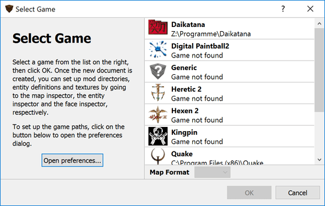

The list of supported games is shown on the right side of the dialog. Below the game list, there is a dropdown menu for choosing a map format; this is only shown if the game supports more than one map format. One example for this is Quake, which supports both the standard format and the Valve 220 format for map files. In the screenshot above, none of the games in the list were actually found on the hard disk. This is because the respective game paths have not been configured yet. TrenchBroom allows you to create maps for missing games, but you will not be able to see the entity models in the editor and other resources such as materials might be missing as well. To open the game configuration preferences, you can click the button labeled "Open preferences...". Click [here](#game_configuration) to find out how to configure the supported games.

Once you have selected a game and a map format, TrenchBroom will open the main editing window with a new map. The following section gives an overview of this window and its main elements. If you want to find out how to [work with mods](#mods) and how to [add materials](#material_management), you can skip ahead to the respective sections.

## Main Window {#main_window}

The main window consists of a menu bar, a toolbar, the editing area, an inspector on the right and an info panel at the bottom. In the screenshot below, there are three editing areas: one 3D viewport and two orthographic 2D editing areas.


The sizes of the editing area, the inspector and the info bar can be changed by dragging the dividers with the mouse. This applies to some of the dividers in the inspector as well. If a divider is 2 pixels thick, it can be dragged with the mouse. The positions of the dividers and the size of the editing window are saved when you close a window. The following subsections introduce the most important parts of the main window: the editing area, the inspector, and the info bar. The toolbar and the menu will be explained in more detail in later sections.

### The Editing Area

The editing area is divided in two sections: The context sensitive info bar at the top and the viewports below. The info bar contains different controls depending on which tool is currently activated. You can switch between tools such as the rotate tool and the vertex tool using the toolbar buttons, the menu or with the respective keyboard shortcuts. The context sensitive controls allow you to perform certain actions that are relevant to the current tool such as setting the rotation center when in the rotate tool or moving objects by a given delta when in the default move tool. Additionally, there is a button labeled "View Options" on the right of the info bar. Clicking on this button unfolds a dropdown containing controls to [filter out](#filtering_rendering_options) certain objects in the viewports or to change how the viewport [renders its contents](#filtering_rendering_options).

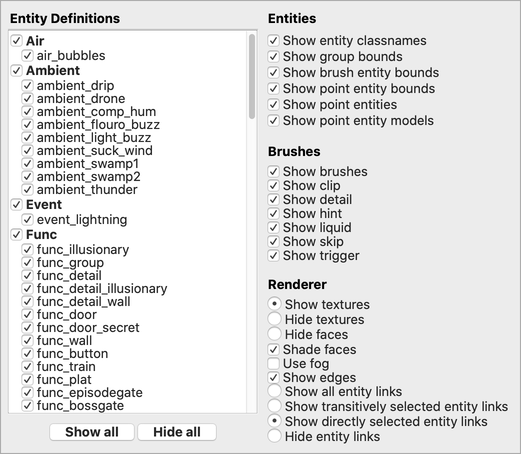

There are two types of viewports: 3D viewports and 2D viewports. TrenchBroom gives you some control over the layout of the viewports: You can have one, two, three, or four viewports. See section [View Layout and Rendering](#view_layout_and_rendering) to find out how to change the layout of the viewports. If you have fewer than four viewports, then one of the viewports can be cycled by hitting #action(Controls/Map view/Cycle map view). Which of the viewports can be cycled and the order of cycling the viewports is given in the following table:

No. of Viewports    Cycling View         Cycling Order
----------------    ------------         -------------
1                   Single view          3D > XY > XZ > YZ
2                   Right view           XY > XZ > YZ
3                   Bottom right view    XZ > YZ
4                   None

There are three types of 2D viewports: the XY, the XZ, and the YZ viewport. You can also think of these viewports as the top, the front, and the side view, respectively. The following table summarizes the properties of the three 2D viewports. Remember that Quake-based engines use a right handed coordinate system.

Viewport    Right Axis    Up Axis    Normal Axis    Name
--------    ----------    -------    -----------    ----
XY          +X            +Y         +Z             Top
XZ          +X            +Z         -Y             Front
YZ          +Y            +Z         +X             Side

The normal axis is the axis that would be protruding from the screen when looking at the respective 2D viewport. In the case of the XY viewport, the normal axis is the positive Z axis, but in the case of the XZ viewport, the normal axis is the negative Y axis. For the mathematically inclined, the normal axis is the cross product of the right axis and the up axis. Sometimes, we will also refer to the inverted normal axis as the depth axis. So, the depth axis of the XY viewport is the negative Z axis. We also refer to the plane that is spanned by the first two axes as the view plane of a 2D viewport. Accordingly, the view plane of the XZ viewport is the X/Z plane.

 In the bottom left of each viewport, there is a compass that indicates the orientation of the camera of that viewport. In the 3D viewport, you can see how the compass rotates when you rotate the camera. In the 2D viewport, the compass axes are fixed, but they indicate which of the coordinate system axes are the right and the up axis for that viewport. The colors of the compass hands represent the axes: Red is the X axis, green is the Y axis, and blue is the Z axis (RGB vs. XYZ).

At most one of the viewports can have focus, that is, only one of them can receive mouse and keyboard events. Focus is indicated by a highlight rectangle at the border of the viewport. If no viewport is focused, you have to click on one of them to give it focus. Once a viewport has focus, the focus follows the mouse pointer, that is, to move focus from one viewport to another, simply move the mouse to the other viewport. The focused viewport can also be maximized by choosing #menu(Menu/View/Maximize Current View) from the menu. Hit the same keyboard shortcut again to restore the previous view layout.

### Map Bounds {#map_bounds}


Game engines often impose a limit on the usable/playable volume of space. TrenchBroom can display this limit as a guide to use when creating your map. Such bounds will appear as an orange square or rectangle in the 2D viewports. For example, the image above shows the Quake map McKinley Base (ctf1 from Threewave CTF) within the normal bounds for a Quake map.

 If bounds are configured for a game, they will usually represent the limits observed by the last official release or patch of a particular game engine. Those bounds may not be correct for your situation, so you can disable or modify the displayed bounds using the Map Properties portion of the Map Inspector, as shown here. (More about the Map Inspector in the next section below.)

In Quake-engine games, these bounds represent a limit on the volume that can contain players, items, or other entities. Static geometry (plain brushes) can extend further, which is why these limits are often called "soft bounds". As far as TrenchBroom is concerned however, it is just drawing orange lines at whatever coordinates are indicated in the [game configuration file](#game_configuration_files)... if this is a non-Quake-engine game then the bounds could represent something else.

In any case, keep in mind that the displayed bounds are just a guide that you should use to help yourself stay within the limits of your target game engine. Changing the bounds in TrenchBroom will not change the behavior in the game!

### The Inspector

The inspector is located at the right of the main window and contains various controls, distributed to several pages, to change certain properties of the currently selected objects. You can show or hide the inspector by choosing #menu(Menu/View/Toggle Inspector). To switch directly to a particular inspector page, choose #menu(Menu/View/Switch to Map Inspector) for the map inspector, #menu(Menu/View/Switch to Entity Inspector) for the entity inspector, and #menu(Menu/View/Switch to Face Inspector) for the face inspector.


The **Map Inspector** allows you to edit [layers](#layers), configure displayed [map bounds](#map_bounds), and set up which game modifications ([mods](#mods)) you are working with. The **Entity Inspector** is the tool of choice to change the [properties](#entity_properties) of entities. It also contains an entity browser that allows you to [create new entities](#creating_entities) by dragging them from the browser to a viewport and it allows you to [set up entity definitions](#entity_definitions). Additionally, you can manage entity definition files in the entity inspector. The face inspector is used to edit the attributes of the currently selected faces. At the top, it has a graphical [UV editor](#uv_editor). Below that, you can edit the face attributes directly by editing their values. To select a material for the currently selected faces, you can use the [material browser](#material_browser).

### The Info Bar

You can show or hide the info bar by choosing #menu(Menu/View/Toggle Info Panel). It contains the console where TrenchBroom prints out messages, warnings and errors, and the live [issue browser](#issue_browser) where you can view, filter and resolve issues with your map.

## Camera Navigation {#camera_navigation}

Navigation in TrenchBroom is quite simple and straightforward. You will mostly use the mouse to move and pan the camera and to look around. There are also some keyboard shortcuts to help you position the camera with more precision. Just like in Quake, the camera cannot be rolled - in other words, up is always in the positive Z direction and down is always in the negative Z direction. The behavior of the camera can be controlled in the [preferences](#mouse_input).

### Looking and Moving Around

In the 3D viewport, you can look around by holding the right mouse button and dragging the mouse around. There are several ways to move the camera around. First and foremost, you can move the camera forward and backward in the viewing direction by spinning the scroll wheel. If you prefer to have the scroll wheel move the camera in the direction where the mouse cursor is pointing, you can check the "Move camera towards cursor" option in the preferences. To move the camera sideways and up / down, hold the middle mouse button and drag the mouse in any direction. For tablet users, there is an option in the preferences that will enable you to move the camera horizontally by holding #key(Alt). Additionally, you can use the following keyboard shortcuts:

Direction    Key
---------    ---
Forward      #action(Controls/Camera/Move forward)
Backward     #action(Controls/Camera/Move backward)
Left         #action(Controls/Camera/Move left)
Right        #action(Controls/Camera/Move right)
Up           #action(Controls/Camera/Move up)
Down         #action(Controls/Camera/Move down)

To adjust the movement speed of the these keyboard shortcuts, you can either go the [preferences](#mouse_input) and adjust the corresponding slider, or you can turn the mouse wheel while holding the right mouse button in the 3D view.

### Orbiting

The camera orbit mode allows you to rotate the camera about a selectable point. To get an idea as to what this means, imagine that you define a point in the map by clicking on a brush. The point where you clicked will be the center of your camera orbit. Now image a sphere whose center is the point where you just clicked and whose radius is the distance between the camera and the point. Orbiting will move the camera on the surface of that sphere while adjusting the camera's direction so that you keep looking at the same point. Visually, this is the same as rotating the entire map about the orbit center. Of course, you are not actually rotating anything - only the camera's position and direction are modified. Note that, since up and down are always fixed, you cannot cross the north and south poles of the orbit sphere.

Camera orbit mode is very useful if you are editing a brush because it allows you to view this brush from all sides quickly. Its best to try it and see for yourself how useful it is. To invoke the orbit mode, click and drag with the right mouse button while holding #key(Alt). The orbit center is the point in the map which you initially clicked. Dragging sideways will orbit the camera horizontally and dragging up and down will orbit the camera vertically. You can change the orbit radius during the orbit with the scroll wheel.

### Automatic Navigation

You can center the camera on the current selection by choosing #menu(Menu/View/Camera/Focus on Selection) from the menu. This will position the camera so that all selected objects become visible. The camera will not be rotated at all; only its position will be changed. Note that this action will also adjust the 2D viewports so that the selection becomes visible there as well.

Finally, you can move the camera to a particular position. To do this, choose #menu(Menu/View/Camera/Move Camera to...) and enter the position into the dialog that pops up. This does not affect the 2D views.

## Navigating the 2D Viewports


Navigating the 2D viewports is naturally a lot simpler than navigating the 3D viewport. You can pan the viewport by holding and dragging either the middle or the right mouse button, and you can use the scroll wheel to adjust the zoom. Note that if you have set your viewport layout to show more than one 2D viewport, then the 2D viewports are linked. Specifically, the zoom factor is linked so that you always have a consistent zoom level across all 2D viewports, and the viewports are panned simultaneously along the same axes. This means that if you pan the XY viewport along the X axis, the XZ viewport gets panned along the X axis, too, so that you don't have to pan both viewports manually. Also note that zooming always keeps the coordinates under the mouse pointer invariant, that is, you can focus on a particular object or area by hovering the mouse over it and zooming in or out.

## FOV and Zoom

For the 3D view, the camera FOV (field of vision) can be adjusted in the [view preferences](#view_layout_and_rendering) by dragging the slider. This is a permanent setting.

To temporarily adjust the camera's zoom, hold #key(Shift) and scroll the mouse wheel. To reset the zoom factor, hit #action(Controls/Map view/Reset camera zoom).

# Selection {#selection}

There are two different kinds of things that can be selected in TrenchBroom: objects and brush faces. Most of the time, you will select objects such as entities and brushes. Selecting individual brush faces is only useful for changing their attributes, e.g. the materials. You can only select objects or brush faces, but not both at the same time. However, a selection of brushes (and nothing else) is treated as if all of their brush faces were selected individually.


In the 3D viewport, selected objects are rendered with red edges and slightly tinted faces to distinguish them visually. The bounding box of the selected objects is rendered in red, with spikes extending from every corner when the mouse hovers over one of the selected objects. These spikes are useful to precisely position objects in relation to other objects. Additionally, the dimensions of the bounding box are displayed in the 3D viewport. In a 2D viewport, selected objects are just rendered with red edges. No spikes or bounding boxes are displayed there since the 2D viewports have a continuous grid anyway.

## Selecting Objects

To select a single object, simply left click it in a viewport. Left clicking anywhere in a viewport deselects all other selected objects, so if you wish to select multiple objects, hold #key(Ctrl) while left clicking the objects to be selected. If you click an already selected object while holding #key(Ctrl), it will be deselected. You can also _paint select_ multiple objects. First, select an object, then hold #key(Ctrl) while dragging over unselected objects. Take care not to begin your dragging over a selected object, as this will [duplicate the selected objects](#duplicating_objects). Note that this even applies to occluded objects, so when you start your paint selection, you must ensure that no object under the mouse is selected.

In the 3D viewport, you can only select the frontmost object with the mouse. To select an object that is obstructed by another object, you can use the mouse wheel. First, select the frontmost object, that is, the object that occludes the object that you really wish to select. Then, hold #key(Ctrl) and scroll up to push the selection away from the camera or scroll down to pull the selection towards the camera. Note that the selection depends on what object is under the mouse, so you need to make sure that the mouse cursor hovers over the object that you wish to select.


In a 2D viewport, you can also left click an object to select it. But unlike in the 3D viewport, this will not necessarily select the frontmost object. Instead, TrenchBroom will analyze the objects under the mouse, specifically the faces under the mouse, and it will find the one with the smallest visible area. Having found such a face, it will select the object to which this face belongs. Since entities don't necessarily have faces, the faces of their bounding boxes will be considered instead. The advantage of this technique is that it allows you to easily select occluded objects in the 2D viewports.

You may also think of left click selection like this: In both the 3D viewport or a 2D viewport, TrenchBroom first compiles a set of candidate objects. These are all objects under the mouse. Then, it must choose an object to be selected from these candidates. In the 3D viewport, the frontmost object always wins (unless you're using the scroll wheel to drill the selection), and in a 2D view, the object with the smallest visible area wins. Other than that, selection behaves exactly the same in both viewports, that is, you can hold #key(Ctrl) to select multiple objects and so on.

Sometimes, selecting objects manually is too tedious. To select all currently editable objects, you can choose #menu(Menu/Edit/Select All) from the menu. Note that hidden and locked objects are excluded, so this command is particularly useful in conjunction with those features. Another option to select multiple objects at once is to use _selection brushes_. Just create one or more new brushes that enclose or touch all the objects you wish to select. These brushes are called selection brushes. Select all of these newly created selection brushes, and choose #menu(Menu/Edit/Select Touching) to select every object touched by the selection brushes, or choose #menu(Menu/Edit/Select Inside) to select every object enclosed inside them. Note that selection brushes will disappear after they were made use of.


A similar operation can be found under #menu(Menu/Edit/Select Tall), but this particular operation is only available when a 2D view has focus. It projects the selection brushes onto the view plane of the currently focused 2D viewport, which results in a 2D polygon, and then selects every object that is contained entirely within that polygon. You can think of this as a cheap lasso selection tool that works like #menu(Menu/Edit/Select Inside), but without having to adjust the distance and thickness of the selection brushes.

If you have selected a single brush that belongs to an entity or group, and you wish to select every other object belonging to that entity or group, you can choose #menu(Menu/Edit/Select Siblings). The same effect can be achieved by left double clicking on a brush that belongs to an entity or group. The menu command #menu(Menu/Edit/Select by Line Number) is useful for diagnostic purposes. If an external program such as a map compiler presents you with an error message and a line number indicating where in the map file that error occurred, you can use this menu command to have TrenchBroom select the offending object for you.

Choose #menu(Menu/Edit/Select Inverse) from the menu to invert the selection, i.e. select everything that is currently unselected (excluding hidden and locked objects).

Finally, you can deselect everything by left clicking in the void, or by choosing #menu(Menu/Edit/Select None).

## Selecting Brush Faces

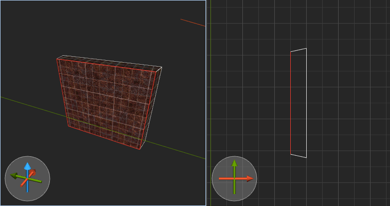

To select a brush face, you need to hold #key(Shift) and left click it in the 3D viewport. You can select multiple brush faces by additionally holding #key(Ctrl). To select all faces of a brush, you can left double click that brush while holding #key(Shift). If you additionally hold #key(Ctrl), the faces are added to the current selection. To paint select brush faces, first select one brush face, then left drag while holding #key(Ctrl) and #key(Shift). To deselect all brush faces, simply click in the void or choose #menu(Menu/Edit/Select None).

# Editing

In this section, we will cover all topics related to the actual editing of a map. We begin by explaining how to set up the map itself, that is, how to set up mods, entity definitions, and material collection. Afterwards, we show you how to create new objects such as entities or brushes, how to edit and transform them, and how to delete them. After that, we explain how you can work with materials in TrenchBroom. The following section introduces the various tools at your disposal to shape brushes while the section after that focuses on entities and how to edit their properties. The goal of the final section is to help you keep an overview in your map by using layers, groups, and by various other means.

## Map Setup

The first step when creating a new map is the setup of mods, entity definitions, and material collections.

### Setting Up Mods {#mod_setup}

 We explained [previously](#mods) that a mod is just a sub directory in the game directory itself. Every game has a default mod that is always active and that cannot be deactivated - in Quake, this is _id1_, the directory that contains all game resources. TrenchBroom supports an unlimited number of additional mods. Mods can be added, removed, and reordered by using the mod editor, which you can find at the bottom of the map inspector.

When the editor starts, the mod editor is folded, but you can unfold it by clicking on its title bar. You are then presented with a two column view of the available mods (left column) and the enabled mods (right column). The list of available mods contains every sub directory in the game directory in alphabetic order. This list can be filtered using the search field at the bottom. To enable some mods, select them in the list of available mods and click on the plus icon below the list of enabled mods. To disable mods, select them in the list of enabled mods and click on the minus icon.

The order of the enabled mods is important because it defines the [priorities for loading resources](#mods). You can change the priority of enabled mods by reordering them in the list. For this, you can select an enabled mod and use the small triangles below the list of enabled mods to push it up or down.

Mods are stored in a worldspawn property called "_tb_mod".

### Loading Entity Definitions {#entity_definition_setup}

 Entity definitions are text files containing information about [the meaning of entities and their properties](#entity_definitions). Depending on the game and mod you are mapping for, you might want to load different entity definitions into the editor. To load an entity definition file into TrenchBroom, switch to the entity inspector and click on the entity browser title bar where it says "Settings". The entity definition browser is horizontally divided into two areas. The upper area contains a list of _builtin_ entity definition files. These are the entity definition files that came with TrenchBroom for the game you are currently working on. You can select one of these builtin files by clicking on it. TrenchBroom will load the file and update its resources accordingly. Alternatively, you may want to load an external entity definition file of your own. To do this, click the button labeled "Browse" in the lower area of the entity definition browser and choose the file you wish to load. Currently, TrenchBroom supports Radiant DEF files and ENT files as well as [Valve FGD][FGD File Format] files. To reload the entity definitions (as well as the referenced models) from the currently loaded external file, you can click the button labeled "Reload" at the bottom or use #menu(Menu/File/Reload Entity Definitions). This may be useful if you're editing an entity definition file for a mod you're working on.

Return to the entity browser by clicking on the entity browser title bar again where it says "Browser".

Note that FGD and ENT files contain much more information than DEF files and are generally preferable. While TrenchBroom supports all of these file types, its support for FGD and for ENT is better and more comprehensive. Unfortunately, DEF files are still relevant because Radiant style editors require them, so TrenchBroom allows you to use them, too.

The path of an external entity definition file is stored in a worldspawn property called "_tb_def".

### Managing Materials {#material_management}

#### Wad Files

Wad files are managed via the `wad` worldspawn property. The property contains a semicolon separated list of paths where TrenchBroom will load a wad file from. Map compilers also use this property to find wad files.

 In TrenchBroom, you cannot edit this property directly, so you must use a smart property editor that's available for the `wad` property. This smart editor is available when you select the `wad` worldspawn property in the entity property editor. Click the `+` icon to add a wad file or the `-` icon to remove the selected wad files. The two triangle icons move a selected wad file up and down in the list. This only has an effect on how name conflicts between materials are resolved. The icon with the two circular arrows reloads all texture wads.

Alternatively, you can drag wad files onto the editor window from a file browser such as the Windows explorer. If the map uses wad files, these files will be loaded and their paths will get appended to the `wad` worldspawn property.

#### Materials from directories

Unless you are using wad files, you don't need to do anything to manage your materials - TrenchBroom will automatically load all available material collections.

If you want to provide your own custom textures, you need to put them in a subdirectory where TrenchBroom can find them. For Quake 2, this means that you need to create a subdirectory called `textures` in the directory of the mod you're mapping for, or in the `baseq2` directory. Then you need to create another subdirectory with a name of your choice. Then you copy your texture files into that directory. TrenchBroom will then find that directory (possibly after restarting the editor) and allow you to load the textures from there. Currently, for a generic game you must create a `textures` folder in the game path directory you set in [game configuration](#game_configuration), or in a directory you loaded as a mod.

You need to place your textures in a subdirectory exactly one level deep in the `textures` folder. Any loose images in `textures` will not be detected, nor will any nested in subdirectories of your collection.

## Interacting with the Editor

Before we delve into specific editing operations such as creating new objects, you should learn some basics about how to interact with the editor itself. In particular, it is important to understand the concept of tools in TrenchBroom and how mouse input is mapped to 3D coordinates.

### Working with Tools

All editing functionality in TrenchBroom is provided by tools. There are two types of tools in TrenchBroom: Permanently active tools and modal tools. Modal tools are tools which have to be activated or deactivated manually by the user. Permanently active tools are tools which are always available, unless they are deactivated by a modal tool. The following table lists all tools with a short description:

Tool                  Viewports    Type          Purpose
----                  ---------    ----          -----------
Camera Tool           2D, 3D       Permanent     Adjusting the 3D camera and the 2D viewports
Selection Tool        2D, 3D       Permanent     Selecting objects and brush faces
Simple Shape Tool     2D, 3D       Permanent*    Creating simple shapes
Complex Shape Tool    3D           Modal         Creating arbitrarily shaped brushes
Entity Drag Tool      2D, 3D       Permanent     Creating entities by drag and drop
Resize Tool           2D, 3D       Permanent*    Resizing brushes by dragging faces
Move Tool             2D, 3D       Permanent*    Moving objects around
Rotate Tool           2D, 3D       Modal         Rotating objects
Scale Tool            2D, 3D       Modal         Scaling brushes
Shear Tool            2D, 3D       Modal         Shearing brushes
Clip Tool             2D, 3D       Modal         Clipping brushes
Vertex Tool           2D, 3D       Modal         Editing brush vertices, edges, and faces

Tools of the type Permanent* are deactivated whenever a modal tool is active. For example you cannot create cuboid brushes when the vertex tool is active. Additionally, at most one modal tool can be active at a time. You can activate and deactivate modal tools using the menu and keyboard shortcuts listed in the following table:

Tool                  Menu
----                  -----------
Complex Shape Tool    #menu(Menu/Edit/Tools/Brush Tool)
Rotate Tool           #menu(Menu/Edit/Tools/Rotate Tool)
Scale Tool            #menu(Menu/Edit/Tools/Scale Tool)
Shear Tool            #menu(Menu/Edit/Tools/Shear Tool)
Clip Tool             #menu(Menu/Edit/Tools/Clip Tool)
Vertex Tool           #menu(Menu/Edit/Tools/Vertex Tool)

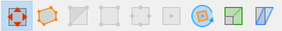 Additionally, tools can be toggled by using the buttons on the left of the toolbar. In the image, the first button is active, however, this particular button does not represent any of the modal tools listed in the table above. Rather, it indicates that no modal tool is currently active, and therefore all permanent tools are available. The buttons icon indicates that objects can be moved, which is only possible if no modal tool is active. The second button represents the convex brush tool, the third button toggles the clip tool, the fourth button is used to toggle the vertex tool and the fifth button toggles the rotate tool.

You can learn more about these tools in later sections. But before you can learn about the tools in detail, you should understand how TrenchBroom processes mouse input, which is what the following two sections will explain.

### Canceling Operations and Tools {#canceling}

To cancel a mouse drag, hit #action(Controls/Map view/Cancel). The operation will be undone immediately. The same keyboard shortcut can be used to cancel all kinds of things in the editor. The following table lists the effects of canceling depending on the current state of the editor.

State                 Effect
-----                 ------
Complex Shape Tool    Discard all placed points; deactivate tool
Clip Tool             Discard most recently placed clip point; deactivate tool
Vertex Tool           Discard current vertex selection; deactivate tool
Selection Tool        Discard current selection

For those tools where a second effect is listed (separated by a semicolon), the second effect only takes place if the first effect couldn't be realized. For example, if the clip tool is active but no clip points have been placed, then hitting #action(Controls/Map view/Cancel) will deactivate the clip tool. Hitting #action(Controls/Map view/Cancel) yet again will deselect all selected objects or brush faces.

In addition, you can hit #action(Controls/Map view/Deactivate current tool) to directly deactivate the current tool regardless of what state the tool is in.

### Mouse Input in 3D

It is very important that you understand how mouse input is mapped to 3D coordinates when editing objects in TrenchBroom's 3D viewport. Since the mouse is a 2D input device, you cannot directly control all three dimensions when you edit objects with the mouse. For example, if you want to move a brush around, you can only move it in two directions by dragging it. Because of this, TrenchBroom maps mouse input to the horizontal XY plane. This means that you can only move things around horizontally by default. To move an object vertically, you need to hold #key(Alt) during editing. This applies to moving objects and vertices, for the most part.

But this is not always true, since some editing operations are spatially restricted. For example, when resizing a brush, you drag one of its faces along its normal, so the editing operation is restricted to that normal vector. In fact, the mouse pointer's position must be mapped to a one-dimensional value that represents the distance by which the brush face has been dragged. Whenever mouse input has to be mapped to one or two dimensions, TrenchBroom does this mapping automatically and no additional thought is required. But if mouse input must be mapped to three dimensions, TrenchBroom does so by employing the editing plane metaphor explained before.

### Mouse Input in 2D

Mapping mouse input to 3D coordinates is much simpler in the 2D viewports, because the first and second dimension is given by the fixed viewport axes, and the third dimension (the depth) is usually taken from the context of the editing operation. For example, if you move an object by left dragging it in the XY viewport, then the mouse input is mapped to the X and Y axes, and the object's Z coordinates remain unchanged. When creating new objects, the depth is usually computed from the bounds of the most recently selected objects. So if you create a new brush by left dragging in the XY view, its distance and its height is determined by the most recently selected objects, while its X/Y extents are determined by the mouse drag.

### Axis Restriction {#axis_restriction}

To avoid imprecise movements when moving objects in two dimensions, you can limit movement to a single axis when using the mouse. By default, objects are moved on the XY plane in the 3D viewport or on the view plane in the 2D viewports. To move objects vertically in the 3D viewport, you have to hold #key(Alt). This works either when you start moving the objects and also during a drag. Furthermore, when moving objects on the XY plane in the 3D viewport or on the view plane in the 2D viewports, you can restrict the movement to one axis by holding #key(Shift). TrenchBroom will then restrict movement to the axis on which the objects have moved the farthest. So if you are moving objects in the 3D viewport and you want to restrict movement to the X axis, move the objects some distance along the X axis and press #key(Shift) to lock all movement to that axis. When you release #key(Shift), the restriction is lifted again and the objects will move to the position under the mouse. This applies not only to moving objects, but also moving vertices in the vertex tool and moving clip points in the clip tool. In the clip tool, the axis restriction only works in the 2D viewports however.

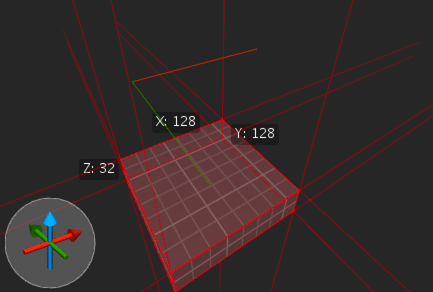

Note that TrenchBroom draws a trace line for you when you move objects with the mouse. The trace line helps to move objects in straight lines and as a visual feedback for your move. When an axis restriction is active, the trace line is rendered thicker.

### The Grid

TrenchBroom provides you with a static grid to align your objects to each other. The grid size can be 1, 2, 4, 8, 16, etc. up to 256. It is also possible to set the grid size to a value smaller than 1, more precisely to 0.5, 0.25 or 0.125. If grid snapping is enabled, then most editing operations will be snapped to the grid. For example, you can only move objects by the current grid size if grid snapping is enabled. In the 3D viewport, the grid is projected onto the brush faces. Therefore the grid may appear distorted if a brush face is not axis aligned. In the 2D viewports, the grid is just drawn in the background. You can change the brightness of the grid lines in the preferences.

The grid size can be set via the menu, or by scrolling the mouse wheel while holding both #key(Alt) and #key(Ctrl).

### Map View Context Menu {#map_view_context_menu}

Right clicking in a map view gives the following context menu:

Group
:   [Groups](#groups) the selected objects.

Ungroup
:   [Ungroups](#groups) the selected objects.

Merge groups
:   When multiple groups are selected, merges them into a single group.

Rename Groups
:   Rename the selected groups.

Move to Layer
:   Move the selected objects to the chosen [layer](#layers).

Make Layer LAYERNAME Active
:   Changes the [current layer](#layers) to the chosen layer.

Hide Layers
:   Hide all layers which contain selected objects.

Isolate Layers
:   Isolate the layers containing selected objects.

Select All in Layers
:   Select all objects in the layers which contain the selected objects.

Make Structural
:   Moves brushes back into the world and clears any content flags. See [Brush Entities](#brush_entities).

Reveal MATERIALNAME in Material Browser
:   Switches to the face inspector and scroll to the clicked material in the [Material Browser](#material_browser).

Create Point Entity
:   Create a [Point Entity](#point_entities) of the chosen type.

Create Brush Entity
:   Create a [Brush Entity](#brush_entities) with the selected brushes.

## Creating Objects

TrenchBroom gives you various options on how to create new objects. In the following sections, we will introduce these options one by one.

### Creating Simple Shapes

The easiest way to create a new brush is to just draw it out with the mouse using the Simple Shape Tool. The tool is enabled by default when nothing else is selected or any other tool active. Left drag in the 3D viewport or any of the 2D viewports.

When drawing a brush in the 3D viewport, its shape is controlled from the point under the mouse where you initially started your drag, to the point currently under the mouse cursor, and the current grid size. When drawing your brush on the XY axes, the height of the brush will be set to the current grid size. While dragging you can force X and Y axes to be equal by holding #key(Shift), or force X, Y and Z axes to be equal by holding #key(Shift)+#key(Alt), and its also possible to change just the height while drawing a brush by holding #key(Alt).


When drawing a brush in a 2D viewport, you only control its extents on whatever axes the 2D view is set to display. So if you are drawing a brush in the XZ view, you control the X/Z extents with the mouse, and there's no way to change the Y extents directly, which is always fixed to the Y extents of the most recently selected objects. This of course applies to all of the different 2D viewports in the same way.

In either case, the material assigned to the newly created brush is the _current material_. The current material is set by choosing a material in the [material browser](#material_browser) or by selecting a face that already has a material. This concept applies to other ways of creating new brushes, too.

This way of creating brushes only allows you to the simple shapes listed in the following table. In the next section, you will learn how to create more complex brush shapes with the complex shape tool.

Shape                  Description
-----                  -----------
Cuboid                 Creates a cuboid shape
Cylinder               Creates a cylinder with a variable number of sides; potentially hollow
Cone                   Creates a cone with a variable number of sides
Spheroid (UV)          Creates a spheroid shape made up of triangles and quads with two poles
Spheroid (Icosahedron) Creates a spheroid shape made up of triangles, based on an icosahedron

Note that the cylinder, cone and UV sphere shapes all have similar options, namely the number of sides and a circle mode.
By using the same values for these options across different shapes, TrenchBroom will create shapes that fit onto each other perfectly.

There are three circle modes that can be selected via the corresponding buttons:

Mode                                Description
----                                -----------
   Creates a circle with 4 edges aligned to the bounding box
 Creates a circle with 4 vertices aligned to the bounding box
      Creates a scalable circle

The last shape requires some explanation. It is not a perfect circle, rather, its vertices are slightly displaced so as to be perfectly aligned on the grid. Consider the following example.


This hollow cylinder is scalable because its vertices are all aligned on the grid. Scaling it larger or smaller will keep the vertices neatly on an integer grid, and this can be beneficial for Quake-like map compilers because they usually handle geometry better when it is aligned on the grid. Scalable shapes can only have 12, 24, 48 or 96 sides. These types of curves are also called [CZG curves](https://www.quaketerminus.com/hosted/happymaps/curv_tut.htm).


If you create an asymmetric scalable shape, it will not be scaled to fit the bounding box drawn with the mouse like the other shapes. Rather, only the middle portion of it will be elongated so that the vertices remain on the grid. This even applies to cones and UV spheres so that the different shapes still fit together.

### Creating Complex Shapes

 If you want to create a brush that is not a simple, axis-aligned cuboid, you can use the brush tool. The brush tool allows you to define a set of points and create the convex hull of these points. A convex hull is the smallest convex volume that contains all the points. The points become the vertices of the new brush, unless they are placed within the brush, in which case they are discarded. Accordingly, the brush tool gives you several ways to place points, but there are two limitations: First, you can only place points in the 3D viewport, and second, you can only place points by using other brushes as reference.

To use the brush tool, you first have to activate it by choosing #menu(Menu/Edit/Tools/Brush Tool). Then, you can place single points onto the grid by left clicking on the faces of other brushes. Additionally, you can left double click on a face to place points on all of its vertices. You can also draw a rectangular shape by left dragging on an existing brush face and thereby place four points at the corners of that rectangle. Finally, if the points you have placed so far form a polygon, you can duplicate and move that polygon along its normal by left dragging it while holding #key(Shift). Once you have placed all points, hit #action(Controls/Map view/Create brush) to actually create the brush.

It is not possible to modify or remove points after they have been placed, except discarding all of them by hitting the #action(Controls/Map view/Cancel) key.

### Creating Entities {#creating_entities}

There are two types of entities: point entities and brush entities, and it depends on the type how an entity is created. In the following sections, we present three ways of creating point entities and two ways to create brush entities.

#### Point Entities {#point_entities}

There are three ways of creating new point entities. Firstly, you can drop new entities in the 3D and 2D viewports by using the [map view context menu](#map_view_context_menu). To open the context menu, right click into the viewport. To create a point entity such as a pickup weapon or a monster, open the "Create Point Entity" sub menu and select the correct entity definition from the sub menus.


The location of the newly created entity depends on whether you clicked on the 3D viewport or a 2D viewport. If you clicked on the 3D viewport, then the entity will be placed on the brush under the mouse. If there was no brush under the mouse, then the entity will be placed at a default distance. Note that the bounding box of the entity will be snapped to the grid. If you clicked on the 2D view, then the position of the entity depends on what was under the mouse when you clicked, too. If a selected brush was under the mouse, then the new entity will be placed on that brush. If no selected brush was under the mouse, then the entity will be placed at the far end of the bounding box of the most recently selected objects. Again, the bounding box of the newly created entity will be snapped to the grid.

 Secondly, you can create new point entities by dragging them from the entity browser. The entity browser can be found in the entity inspector page. At the bottom of the entity browser, you can find a number of controls to change the sort order and to filter the entities displayed in the browser.

The leftmost dropdown list allows you to change the sort order. Entities can be sorted by name or by their usage count, with the most used entities at the top. The "Group" button toggles grouping the entities by their category, which is derived from the first part of the entity name. For example, all entities starting with "key_" are put into a category called "key". The button labeled "Used" toggles all unused entities, when it is pressed, only those entities which are used in the map are shown in the browser. To filter entities by name, enter some text in the search box on the right. Only entities containing the search text will be shown in the browser.

To create a new entity, simply drag it out of the browser and onto the 3D or a 2D viewport. If you drag it onto the 3D viewport, the entity will be positioned on the brush under the mouse, with its bounding box snapped to the grid. If you drag the entity onto a 2D viewport, its position is determined by the far end of the most recently selected object.

Finally, you can create specific entities by assigning a keyboard shortcut in the [preferences](#keyboard_shortcuts). This is useful for entities that are used very often such as lights. The entity will be created under the mouse cursor; its position will be computed in the same way as if the context menu was used.

#### Brush Entities {#brush_entities}

 Creating brush entities is also done using the context menu. Select a couple of brushes and right click on them, then select the desired brush entity from the menu. To move brushes from one brush entity to another, select the brushes you wish to move and right click on a brush belonging to the brush entity to which you want to move the brushes, and select "Move brushes to Entity ENTITY", where "ENTITY" is the name of the target brush entity, for example "func_door" in the picture on the left. If the brush entity containing the brushes to be moved becomes empty, it will be automatically deleted. To move brushes from a brush entity back into the world and clear content flags, select the brushes, right click and select "Make Structural".

Additionally, you can also assign a keyboard shortcut to create a specific brush entity in the [preferences](#keyboard_shortcuts).

Often, it is much quicker to create new objects by duplicating existing ones. Objects can be duplicated using dedicated functions in TrenchBroom, or just by copying and pasting them.

### Duplicating Objects {#duplicating_objects}

The currently selected objects can be duplicated by choosing #menu(Menu/Edit/Duplicate). This will duplicate the objects in place, that is, the duplicates retain the exact position of the original objects. To give visual feedback, the duplicated objects are flashed in white really quickly. In the following short clip, you can see that the selected brush gets duplicated. After that, the duplicated brush is moved upwards.


Very often, you will want to duplicate objects and move them to a different position immediately afterwards, because having duplicates retain the same position as their originals is very seldom useful. That's why you can also duplicate and move objects at once without having to perform two separate actions. To duplicate and move objects, you can use the following keyboard shortcuts:

Direction     Shortcut (2D)                                                                                        Shortcut (3D)
---------     -------------                                                                                        -------------
Left          #action(Controls/Map view/Duplicate and move objects left)                                           #action(Controls/Map view/Duplicate and move objects left)
Right         #action(Controls/Map view/Duplicate and move objects right)                                          #action(Controls/Map view/Duplicate and move objects right)
Up            #action(Controls/Map view/Duplicate and move objects up; Duplicate and move objects forward)         #action(Controls/Map view/Duplicate and move objects backward; Duplicate and move objects up)
Down          #action(Controls/Map view/Duplicate and move objects down; Duplicate and move objects backward)      #action(Controls/Map view/Duplicate and move objects forward; Duplicate and move objects down)
Forward       #action(Controls/Map view/Duplicate and move objects forward; Duplicate and move objects down)       #action(Controls/Map view/Duplicate and move objects up; Duplicate and move objects forward)
Backward      #action(Controls/Map view/Duplicate and move objects backward; Duplicate and move objects up)        #action(Controls/Map view/Duplicate and move objects down; Duplicate and move objects backward)

Essentially, these are the same keyboard shortcuts that you use to [move objects around](#moving_objects) in the 3D and 2D viewports, but while holding #key(Ctrl). In the same vein, you can hold #key(Ctrl) while left dragging a selected object to duplicate and move all selected objects.


Note that in the image above, the selected brush flashes while it is moved to the right. This indicates that in this case, the duplication and the translation happened at the same time instead of one after the other as in the previous example.

### Copy and Paste

You can copy objects by selecting them and choosing #menu(Menu/Edit/Copy). TrenchBroom will create text representations of the selected objects as if they were saved to a map, and put that text representation on the clipboard. This allows you to paste them into map files, and also to directly copy objects from map files and paste them into TrenchBroom. Note that you can also copy brush faces, which will also put a text representation of that brush face on the clipboard. Having copied a brush face, you can paste the attributes of that face (material, offset, scale, etc.) into other selected brush faces.

There are two menu commands to paste objects from the clipboard into the map. The simpler of the two is #menu(Menu/Edit/Paste at Original Position), which will simply paste the objects from the clipboard without changing their position. The other command, available at #menu(Menu/Edit/Paste), does not paste the objects from the clipboard at their original positions, but will try to position them using the current mouse position. If pasted into the 3D viewport, the pasted objects will be placed on top of the brush under the mouse. If no brush is under the mouse, the objects will be placed at a default distance. The bounding box of the pasted objects is snapped to the grid, and TrenchBroom will attempt to keep the center of the bounding box of the pasted objects near the mouse cursor. The following clip illustrates these concepts. The light fixture is copied, then pasted several times.


Positioning of objects pasted into a 2D viewport attempts to achieve a similar effect by positioning the pasted objects such that they line up with the far end of the bounds of the most recently selected objects while keeping them under the mouse, with their center snapped to the grid.

## Editing Objects

The following section is divided into several sub sections: First, we introduce editing operations that can be applied to all objects, such as moving, rotating, or deleting them. Then we proceed with the tools to shape brushes, such as the clip tool, the vertex tool, and the CSG operations. Afterwards we explain how you work with materials in TrenchBroom, and then we move on to editing entities and their properties. The final subsection deals with TrenchBroom's undo and redo capabilities.

### Moving Objects {#moving_objects}

You can move objects around by using either the mouse or keyboard shortcuts. Left click and drag on a selected object to move it (and all other selected objects) around. In the 3D viewport, the objects are moved on the XY plane by default. Hold #key(Alt) to move the objects vertically along the Z axis. In a 2D viewport, the objects are moved on the viewport's view plane. There is no way to change an object's distance from the camera using the mouse in a 2D viewport. If grid snapping is enabled, the distances by which you move them are snapped to the grid component-wise, that is, if the grid is set to 16 units, you can move objects by 16 units in either direction.

You can also use the keyboard to move objects. Every time you hit one of the shortcuts in the following table, the object will move in the appropriate direction by the current grid size. Also remember that you can [duplicate objects and move them](#duplicating_objects) in the given direction in one operation by holding #key(Ctrl) and hitting one of the keyboard shortcuts listed below.

Direction     Shortcut (2D)                                                            Shortcut (3D)
---------     -------------                                                            -------------
Left          #action(Controls/Map view/Move objects left)                             #action(Controls/Map view/Move objects left)
Right         #action(Controls/Map view/Move objects right)                            #action(Controls/Map view/Move objects right)
Up            #action(Controls/Map view/Move objects up; Move objects forward)         #action(Controls/Map view/Move objects backward; Move objects up)
Down          #action(Controls/Map view/Move objects down; Move objects backward)      #action(Controls/Map view/Move objects forward; Move objects down)
Forward       #action(Controls/Map view/Move objects forward; Move objects down)       #action(Controls/Map view/Move objects up; Move objects forward)
Backward      #action(Controls/Map view/Move objects backward; Move objects up)        #action(Controls/Map view/Move objects down; Move objects backward)

Note that the meaning of the keyboard shortcuts depends on the viewport in which you use them. While #action(Controls/Map view/Move objects up; Move objects forward) moves the selected objects in the direction of the up axis if used in a 2D viewport, it moves the objects (roughly) in the direction of the camera viewing direction (i.e. forward) on the editing plane if used in the 3D viewport. Likewise, #action(Controls/Map view/Move objects forward; Move objects down) moves the selected objects in the direction of the normal axis (i.e. forward) if used in a 2D viewport and in the direction of the negative Z axis if used in the 3D viewport.


To move objects by a specified offset, select #menu(Menu/Edit/Move objects) to bring up a window where you can enter a vector. Click "OK" and the currently selected objects will be moved by that vector.

### Rotating Objects {#rotating_objects}

The easiest way to rotate objects in TrenchBroom is to use the following keyboard shortcuts:

Shortcut                                                        Type     Rotation (3D)                         Rotation (2D)
--------                                                        ----     -------------                         -------------
#action(Controls/Map view/Roll objects clockwise)               Roll     Clockwise about view axis             Clockwise about normal axis
#action(Controls/Map view/Roll objects counter-clockwise)       Roll     Counter-clockwise about view axis     Counter-clockwise about normal axis
#action(Controls/Map view/Pitch objects clockwise)              Pitch    Clockwise about right axis            Clockwise about right axis
#action(Controls/Map view/Pitch objects counter-clockwise)      Pitch    Counter-Clockwise about right axis    Counter-Clockwise about right axis
#action(Controls/Map view/Yaw objects clockwise)                Yaw      Clockwise about Z axis                Clockwise about up axis
#action(Controls/Map view/Yaw objects counter-clockwise)        Yaw      Counter-clockwise about Z axis        Counter-clockwise about up axis

If the rotate tool is active, these keyboard shortcuts rotate the selected objects using the center of rotation and the angle set using the tool's rotation handle and the input controls above the viewports. If the rotate tool is not active, the center of rotation is the center of the bounding box of the currently selected objects (snapped to the grid), and the rotation angle is fixed to 90.

 The rotate tool gives you more control over rotation than the keyboard shortcuts do. Hit #menu(Menu/Edit/Tools/Rotate Tool) to activate the rotate tool and a rotation handle will appear in the viewports. The rotation handle allows you to set the center of rotation and to perform the actual rotation of the selected objects about the X, Y, or Z axis. In the 3D viewport, you can rotate the objects about any of those axes by left dragging the appropriate part of the rotate handle, but in a 2D viewport, you can only rotate the objects about the normal axis of that viewport. The angle of rotation defaults to 15 degrees, but it can be changed in the controls that appear above the editing views when you activate the rotate tool. During rotation, the current angle of rotation is shown at the center of the rotation handle.

In the 3D viewport, the rotation handle will appear as in the image on the left. It has three axes, color coded with the X axis in red, the Y axis in green, and the Z axis in blue as usual. In addition to the axes, it has three quarter circles, again color coded, and one small spherical handle at the center. The center handle (the yellow sphere) changes the center of rotation if you drag it with the left mouse button. Moving the center of rotation works exactly as [moving objects with the move tool](#moving_objects) does. If you hover the mouse over the center handle, you will notice that the coordinates of the center of rotation are displayed above the center handle and that the handle is highlighted by a red outline. To perform a rotation, you have to drag one of the three color coded quarter circles. When you hover over one of them, it will be highlighted to indicate that you can start dragging. Clicking and dragging the blue quarter circle with the left mouse button rotates the objects about the Z axis, and likewise for the red and green handles (see the clip below).

 In the 2D viewport, the rotation handle will just appear as a circle with one smaller circular handle at the center. The center handle allows you to move the center of rotation on the view plane of that viewport, and the outer circle allows you to perform the rotation. In the 2D viewports, the handle is also color coded, the colors of the outer circle reflecting the axis of rotation in a similar fashion to the 3D rotate handle. To start a rotation, drag the outer circle in a circular fashion. As in the 3D view, the angle of rotation will be snapped to whatever value is entered in the angle control above the editing views, and during rotation the angle will be indicated at the center of the rotation handle.

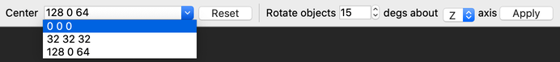

Like the move tool, the rotate tool places some controls above the viewport. On the very left, there is a combo box that displays the coordinates of the center of rotation. This combo box automatically updates if you move the rotate handle around in the 2D or 3D viewports. If you want to set the center of rotation manually, you can enter three coordinates here and hit #key(Return). Alternatively, you can click the button labeled "Reset" to set the center of rotation to the center of the bounding box of the currently selected objects, snapped to the grid. Finally, you can use the combo box to return the center of rotation to a previously used value. The rest of the controls allow you to perform a rotation by entering an angle in the text box, selecting the rotation axis from the dropdown list, and clicking the "Apply" button.


If you look closely at the clip above, you will notice that the entity in the picture, a green armor, rotates nicely with the brush it is placed on. Firstly, its position does not seem to change in relation to the brush, and secondly, its angle of rotation is also changed according to the rotation being performed by the user. Whether and how TrenchBroom can adapt the angle of rotation of an entity depends on the following rules.

- "angles" is interpreted as "pitch yaw roll" (if the entity model is a Quake MDL, pitch is inverted)
- "mangle" is interpreted as "yaw pitch roll" if the entity classnames begins with "light", otherwise it's a synonym for "angles"
- "angle" is interpreted as the rotation angle about the Z axis
- If the point entity's bounding box is not centered in the XY plane (e.g. Quake's misc_explobox), attempts to rotate the entity in TrenchBroom will be blocked. This is done to prevent the model from being rotated out of the collision box, which doesn't rotate in Quake.

Finally, if TrenchBroom has found a property that contains the rotation angle of the entity, it adapts the value of that property according to the rotation being performed by the user. These rules are quite complicated because sadly, the entity definitions do not contain information about how rotations should be applied to entities. But in practice, they should just perform as expected when you work with the rotate tool in the editor.


This behavior can be disabled temporarily by toggling the checkbox to the right of the "Apply" button when the rotate tool is active. If the checkmark is removed, TrenchBroom will not update any entity properties except for the origin when an entity is rotated either by the rotate tool or by a shortcut.

### Flipping Objects {#flipping_objects}

Flipping has the effect of mirroring the selected objects, the mirror being a plane which is defined by the center of the bounding box of the selected objects, snapped to the grid, and by a normal vector. The normal vector of the plane depends on the actual flipping command and the viewing direction of the camera in the 3D viewport or the view plane of the focused 2D viewport. The following table explains how the normal vector is derived from this information.

Shortcut                                                  Direction     Normal (2D)   Normal (3D)
--------                                                  ---------     -----------   -----------
#action(Controls/Map view/Flip objects horizontally)      Horizontal    Right axis    Axis-aligned right axis
#action(Controls/Map view/Flip objects vertically)        Vertical      Up axis       Z axis

In the case of the 3D viewport, the normal of the mirror plane is the coordinate system axis that is closest to the right axis of the camera. This means that if the camera is pointing in the general direction of the Y axis, and therefore its right axis points in the general direction of the X axis, the normal of the mirror plane will be the X axis. Sometimes, you will not be able to determine which of the coordinate system axes is closest to the right axis of the camera because the right axis is close to two coordinate system axes. To avoid such confusion, it is best to perform flipping in the 2D viewports.

### Scaling Objects {#scaling_objects}

Hit #menu(Menu/Edit/Tools/Scale Tool) to activate the scale tool. If you know the exact X/Y/Z scale factors you want, you can enter them in the toolbar and click "Apply". The selected objects will be scaled relative to the center of their bounding box.

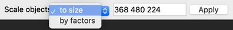

Otherwise, there are various ways to interactively scale your selected objects.

In the 3D view:

- Dragging a side of the bounding box stretches that axis only.

    

- Dragging an edge stretches the two adjacent sides of the bounding box proportionally.

    

- Dragging a corner resizes all 3 axes proportionally.

    

In 2D views:

- Corners allow unconstrained scaling along 2 axes.
- Sides stretch a single axis only, as in the 3D view.

Two modifiers can be used in both the 2D and 3D views:

- Hold #key(Shift) to scale all three axes to scale proportionally in 3D views, or only the two axes perpendicular to the camera in 2D views. You can press/unpress #key(Shift) during a drag. (#key(Shift) has no effect when dragging corners in 3D, since all 3 axes are already scaled proportionally.)

- Hold #key(Alt) to move the scale anchor point to the center of the bounding box. Otherwise, the anchor point is opposite the handle being dragged.

    


### Shearing Objects {#shearing_objects}

Hit #menu(Menu/Edit/Tools/Shear Tool) to activate the shear tool. Dragging a side of the bounding box shears along that plane. You can add the #key(Alt) key to drag vertically if you're not shearing the top or bottom of the bounding box.

Alignment lock in the Shear tool only works in Valve 220 format maps.


### Deleting Objects

Deleting objects is as simple as selecting them and choosing #menu(Menu/Edit/Delete). Note that if you delete all remaining brushes of a brush entity, that entity gets deleted automatically. Likewise, if you delete all remaining objects of a group, that group also gets deleted.

## Shaping Brushes

TrenchBroom offers several tools to change the shapes of brushes. The most powerful of these tools, and also the one that requires the most care, is the vertex tool. Before we discuss this tool, we will introduce the clip tool with which you can chop parts off of brushes. But first, we introduce the extrude tool which, as the name suggests, allows you to quickly change the size of brushes. Finally, we explain how you can shape brushes using TrenchBroom's CSG operations.

### Extrusion

Brushes can be extruded using the extrude tool by moving their faces along their respective normal vectors with the mouse. To extrude a selected brush, hold #key(Shift) and move your mouse pointer onto or near the face you wish to move. You will notice that one of the brush's faces is highlighted with a yellow outline. Drag with your left mouse button while still holding #key(Shift) to move the highlighted face along its normal. Note that you can also move brush faces which are behind the brush as long as these faces have an edge that is visible from the camera.


Note that you cannot change the number of faces of a brush by with the extrude tool. This means that you cannot push a face back into a brush indefinitely. TrenchBroom will refuse to move it further as soon as that movement would make other faces disappear. The same applies to pulling a face out of a brush, which can make that face disappear. This is disallowed as well.

If you hold #key(Ctrl) when you start dragging, the brush will not be extruded. Instead, a new brush will be created. Both of the original and the new brush together will have the same shape that the original would have had if you had just extruded it without holding #key(Ctrl), and the two brushes are split where the face you were dragging originally sat.


When starting a drag with #key(Ctrl) you can also drag inward to split the original brush:


You can also extrude several brushes at the same time by moving their faces using the extrude tool, but only if these faces line up perfectly. As the following animation illustrates, it's not enough that the faces are parallel - they have to be identical.


The extrude tool also works in the 2D viewports, of course, but the ability to move faces which are behind the selected brush is absent there. In both cases, TrenchBroom uses two methods to determine how to snap the distance by which you drag the face:

- The distance is snapped to the current grid size, i.e., if you drag a face by 17.5 units along its normal, it will be moved by 16.0 units if the current grid size is 16. This is useful if you are resizing brushes which are part of a curve because their faces will line up after the drag.
- The vertices of the dragged faces are snapped to the grid planes, i.e., whenever at least one vertex component (X,Y, or Z) is a multiple of the current grid size, the face is snapped to that vertex. This makes it easy to align a face to other adjacent faces.

Both snap modes are used simultaneously. There may be situations when you have to move the camera closer to a face in order to have sufficient precision when dragging the face.

#### Moving Faces Instead of Extruding {#moving_faces}

The brush extrude tool offers a quick way to move an individual face of a brush in 2D views. Hold #key(Alt) in addition to #key(Shift) when starting to drag a face in a 2D view to enable this mode. You will notice that a face is highlighted as usual, but when you start dragging the mouse, the face will just be moved in the direction you are dragging. The move is not restricted by the face normal, and other faces will be affected as well.


The distance is snapped to the current grid size. Moving multiple faces is possible if the faces lie on the same plane. The [UV Lock](#uv_lock) setting controls whether alignment lock is used when dragging faces using this mode.

### Clipping

Clipping is the most basic operation for Quake maps due to how brushes are [constructed from planes](#brush_geometry). In essence, all that clipping does is adding a new plane to a brush and, depending on the brush's shape, removing other planes from it if they become superfluous. In TrenchBroom, clipping is done using the clip tool, which you can activate by choosing #menu(Menu/Edit/Tools/Clip Tool). The clip tool lets you define a clip plane in various ways, and the lets you apply that plane to the selected brushes.

There are three different outcomes of applying a clip plane: Drop all parts of the selected brushes that are in front of the (oriented) clip plane, drop all parts of the selected brushes that are behind the clip plane, or slice the selected brushes into two pieces each. The following image illustrates these three modes:


In all three images, there is a clip plane defined by two points. This clip plane slices the single brush in the image into two parts whereby the left part is below the plane and the right part is above it. In the first image, the clip mode is set to retain the part of the brush that is below the clip plane and to discard the part that is above the clip plane. The resulting brush will be shaped like the red part of the brush in the image. In the second image, the clip mode is set to retain both parts of the brush, and the result of this clipping operation will be two brushes. In the third image, the clip mode is set to retain the part of the brush that is above the clip plane and to discard the other part. This is the opposite of the first case. In the clip tool, you can cycle through these three modes by hitting #action(Controls/Map view/Toggle clip side). There are two ways of defining a clip plane: The more common way is to place at least two and and most three points (in this context, these points are called clip points) in either the 3D or a 2D viewport. The other way is to define the clip plane by using an existing brush face.

#### Clip Points

To place clip points, you simply left click into a viewport when the clip tool is active. Alternatively, you can add two clip points at once by dragging with the left mouse. In that case, the first clip point is placed at the start point of the drag, and the second clip point is placed at the end point of the drag. In the 3D viewport, you can only place clip points on already existing brushes, whereas in the 2D viewports, you can place them anywhere. Clip points are snapped to the grid, however, in the 3D viewport, there is a caveat which we will explain below. When the clip tool is active, it gives you some feedback in the form of an orange sphere that appears close to your mouse pointer. This sphere indicates where a clip point would be placed after being snapped to the grid. This feedback sphere is only shown if a clip point can actually be placed at or close to the point under the mouse.

Once two clip points have been placed, TrenchBroom will attempt to guess a clip plane even though it is underspecified: You cannot define a plane with only two points. If you are happy with the clip plane that TrenchBroom has determined, then you can apply the clipping operation by hitting #action(Controls/Map view/Perform clip). Otherwise, you can place the third point to fully define the clip plane, or you can change the clip points you have already placed. To change a clip point, you can just left click and drag it with the mouse. To remove the most recently place clip point, you can choose #menu(Menu/Edit/Delete).

#### Clip Point Snapping

In the 3D viewport, clip points can only be placed on the faces of already existing brushes. Such a clip point is snapped to the grid that has been projected onto the brush face on which you placed that point. So it appears to be snapped to the projected grid, but it is also kept glued onto the brush face. If the point were snapped in all dimensions, then it would either sink into or move away from the brush face it was placed on. TrenchBroom avoids this by glueing clip points to the brush faces on which they were placed by the user. This means that if you attempt to move an already placed clip point around using the 3D viewport, that point will be moved to the closest snapped point on the brush face under the mouse.

In the 2D viewport, clip points are just snapped to the visible grid, so they are not restricted to being glued to brush faces. You can place clip points in any viewport you wish, and you can move clip points that have been placed in one viewport using any other viewport, but the grid snapping will be that of the viewport that you are using to move the clip point. That means if you use a 2D viewport to move a clip point that was placed in the 3D viewport, then that point can be dragged off of the brush face on which it was placed and into the void. Conversely, if you use the 3D viewport to move a clip point that was placed in a 2D viewport, that clip point will snap onto  the brush face under the mouse, or it will not move at all if there is no brush face under the mouse.

#### Matching Clip Plane

 The clip plane can also be defined by matching it to an existing brush face. To match a clip plane to an existing brush face, you have to double click that face in the 3D viewport. As a result, the brush face gets an orange outline, and a clip plane is defined to match the face's plane exactly. This can be quite useful when shaping geometry to other geometry. Note that the plane points of the clip plane are the plane points of the brush face to which the clip plane was matched, so there should be no trouble with microleaks when using this particular function.

### Vertex Editing {#vertex_editing}

TrenchBroom includes three separate tools to edit a brush's vertices: the [vertex tool](#vertex_tool) for editing individual vertices, the [edge tool](#edge_tool) for editing individual edges, and the [face tool](#face_tool) for editing individual faces. The vertex tool is the most powerful of the three because in addition to moving vertices around, you can also add and remove vertices from the brush(es). Conversely, the edge and face tools only allow you to move faces around.

#### Vertex Tool {#vertex_tool}

Using the vertex tool, you can move individual vertices around in 3D space. Additionally, you can add vertices to a brush, and you can remove vertices from a brush. To activate the vertex tool, choose Choose #menu(Menu/Edit/Tools/Vertex Tool). When the vertex tool is active, yellow handles appear at the vertices of the selected brushes to allow manipulation.


Moving the mouse pointer over a vertex handle highlights that handle with a red circular outline, and the position of that handle is displayed above it.

Selecting vertex handles is treated in the same way as selecting objects. Click on a handle to select it. Multiple handles can be selected by holding #key(Ctrl). The vertex tool also allows you to select multiple handles using a selection lasso. Left drag with the mouse button to create a rectangular selection lasso. Release the left mouse button, and all handles inside the lasso are selected. If the lasso rectangle contains a vertex handle that's already selected, then it will be deselected. To ensure that all vertex handles inside the lasso are selected regardless of their previous selection state, hold #key(Ctrl).

When you have selected some vertex handles, you can move them around by dragging them with the left mouse button. Moving vertex handles (and their corresponding vertices) works in a similar fashion to moving objects, so in the 3D viewport, you can move them on the XY plane, or you can hold #key(Alt) to move them vertically. In a 2D viewport, you can move the vertex handles on the view plane of that viewport. If you begin your drag on an unselected vertex handle, that vertex handle is automatically selected, so if you just want to move a single vertex around, you do not need to select it first. Once you press the left mouse button on a vertex handle to begin a drag, yellow guide lines show up that help you to position the vertex in relation to other objects. When moving vertex handles around, the move distances are snapped to the current grid size component wise, just like when you move objects. If you prefer to have the absolute vertex positions snapped to the grid, you can toggle between relative and absolute snapping using #key(Ctrl) during the drag.

 TrenchBroom ensures that you do not create invalid brushes with the vertex tool. For example, it is impossible to make a brush concave by pushing a vertex into the brush. To achieve this, TrenchBroom will chop up the faces incident to that vertex into triangles depending on the direction in which that vertex is moved. In the animation on the left, you can see that the top face of the cube has one triangle chopped off in the first move where the vertex is moved downward, while in the second move, the front face is chopped into a triangle fan when the vertex is moved outward. Sometimes, TrenchBroom will even delete a vertex if a move would push it inside the brush, which would make it concave. In such a case, the vertex move is concluded.

The vertex tool also allows you to fuse adjacent vertices. If a vertex ends up on an adjacent vertex during a vertex move, the two vertices will be fused. This does not conclude the move however, you can keep moving the fused vertex, and it remains selected. Note that fusing is not allowed when you are moving edges or faces, even though fusing does happen when you move multiple vertices at once.

If you wish to snap a vertex onto another vertex quickly without performing a drag, you can just click on the target vertex while holding #key(Shift)#key(Alt).

<br clear="all" />

 Besides moving, fusing and deleting vertices, you can also add new vertices to a brush with the vertex tool. Hold #key(Shift) and move your mouse over the position on the grid where you wish to add a vertex. Notice that a new vertex handle is shown when your mouse pointer is close to that point. Click and drag the handle to add a new vertex.

Additionally, you can delete the selected vertices, edges, and faces from brushes by choosing #menu(Menu/Edit/Delete). Note that this will only succeed if none of the currently selected brushes becomes invalid by the deletions, that is, you can only delete vertices, edges, or faces if all of the selected brushes remain three-dimensional after the deletions. If that is not the case, TrenchBroom will refuse the entire operation.

<br clear="all" />

 Vertex editing is not limited to working with single brushes. Selecting more than one brush and activating the vertex tool will cause vertex handles to appear for all brushes in the selection. This is more useful when working on organic brushwork such as terrain. You can build a large group of brushes and modify them all at once without having to change the selection. TrenchBroom will recognize when vertices of multiple brushes share the same position. In this case, when trying to move a vertex, TrenchBroom will move all those vertices together, making editing terrain much quicker and easier. In the following animation, the vertices under the cursor were moved with a single drag operation because they share the same position.

<br clear="all" />

The vertex tool also provides some keyboard shortcuts to move vertices. These are listed in the following table.

Direction     Shortcut (2D)                                                            Shortcut (3D)
---------     -------------                                                            -------------
Left          #action(Controls/Map view/Move objects left)                             #action(Controls/Map view/Move objects left)
Right         #action(Controls/Map view/Move objects right)                            #action(Controls/Map view/Move objects right)
Up            #action(Controls/Map view/Move objects up; Move objects forward)         #action(Controls/Map view/Move objects backward; Move objects up)
Down          #action(Controls/Map view/Move objects down; Move objects backward)      #action(Controls/Map view/Move objects forward; Move objects down)
Forward       #action(Controls/Map view/Move objects forward; Move objects down)       #action(Controls/Map view/Move objects up; Move objects forward)
Backward      #action(Controls/Map view/Move objects backward; Move objects up)        #action(Controls/Map view/Move objects down; Move objects backward)

This concludes the functionality of the vertex tool. While it is very powerful, it should also be used with care, as vertex editing can sometimes create invalid brushes and microleaks in the map. To help you avoid such problems, the following section contains a few best practices you should keep in mind when you use the vertex tool.


#### Edge Tool {#edge_tool}

Using the edge tool, you can move individual edge around in 3D space. To activate the edge tool, choose Choose #menu(Menu/Edit/Tools/Edge Tool). When the edge tool is active, the edges of the selected brushes are rendered yellow to indicate that they allow manipulation. Furthermore, a handle appears at the center of each edge.

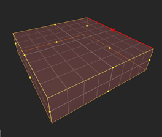

Moving the mouse pointer over an edge handle highlights that handle in red. Selecting edge handles works in the same way as selecting vertex handles. Click on a handle to select it. Multiple handles can be selected by holding #key(Ctrl). Selected handles are rendered in red. The edge tool also allows you to select multiple handles using a selection lasso. Left drag with the mouse button to create a rectangular selection lasso. Release the left mouse button, and all handles contained in the lasso are selected. If the lasso rectangle contains an edge handle that's already selected, then it will be deselected. To ensure that all edge handles contained in the lasso are selected regardless of their previous selection state, hold #key(Ctrl).

When you have selected some edge handles, you can move them around by dragging them with the left mouse button. Moving edge handles (and their corresponding edges) works in same way as moving vertices, with the exception that the tool only supports relative snapping of the move distances. Like the vertex tool, the edge tool will detect if two or more brushes share an edge and move the edges of all selected brushes if a shared edge is moved.

Finally, the edge tool also supports the same keyboard commands as the vertex tool.

#### Face Tool {#face_tool}

Using the face tool, you can move individual face around in 3D space. To activate the face tool, choose Choose #menu(Menu/Edit/Tools/Face Tool). When the face tool is active, the faces of the selected brushes are rendered yellow to indicate that they allow manipulation. Additionally, the tool shows point handles at the centers of the faces; these handles allow selection and manipulation of the faces. Note that the handles allow you to select and manipulate faces which face away from the camera, too.

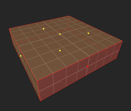

Moving the mouse pointer over an face handle highlights that handle with a red outline. Additionally, the face edges are rendered thicker. Selecting face handles works in the same way as selecting vertex handles. Click on a handle to select it. Multiple handles can be selected by holding #key(Ctrl). Selected handles are rendered in red. The face tool also allows you to select multiple faces using a selection lasso. Left drag with the mouse button to create a rectangular selection lasso. Release the left mouse button, and all face handles contained in the lasso are selected. If the lasso rectangle contains a face handle that's already selected, then it will be deselected. To ensure that all face handles contained in the lasso are selected regardless of their previous selection state, hold #key(Ctrl).

When you have selected some face handles, you can move them around by dragging them with the left mouse button. Moving face handles (and their corresponding faces) works in same way as moving vertices, with the exception that the tool only supports relative snapping of the move distances. Like the vertex tool, the face tool will detect if two or more brushes share an face and move the faces of all selected brushes if a shared face is moved.

Finally, the face tool also supports the same keyboard commands as the vertex tool.

#### Vertex Editing Best Practices

- Don't use it too much on sealing brushes, better to use it on detail.
- Don't do too much in one go, compile and test often.
- When doing terrain, create a quad- or trisoup and only move vertices orthogonal to the grid's plane (along the plane's normal). Don't move vertices sideways.
- Be careful with detail brushes, they might open vis portals.
- Detail might also result in PVS leaves too much information, better to turn some detail into actual brushes to force vis to break a room into several PVS leaves. Or use hint brushes to force vis to add more leaves.

#### UV Lock {#uv_lock}

The regular Alignment Lock preference doesn't apply to vertex editing - instead, there is a separate preference called UV Lock toggled with #menu(Menu/Edit/UV Lock) or the UV Lock toolbar button:

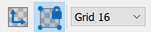

When this setting is enabled, TrenchBroom will attempt to keep vertex UV coordinates the same when using the vertex editing tools or [face moving](#moving_faces).

### CSG Operations

CSG stands for Constructive Solid Geometry. CSG is a technique used in professional modeling tools to create complex shape by combining simple shapes using set operators such as union (sometimes called addition), subtraction, and intersection. However, CSG union and subtraction cannot be directly applied to brushes since they may create concave shapes which cannot be represented directly using brushes (remember that brushes are always convex). But some of these operators can be emulated with brushes. TrenchBroom supports the operations _convex merge_ (in place of union), _subtraction_ (emulated by creating new brushes to represent the resulting concave shape), and _intersection_ (supported directly).

#### CSG Convex Merge

Convex merge takes a set of brushes as its input, computes the _convex hull_ of all vertices of those brushes, and creates a new brush with the shape of the convex hull. The convex hull of a set of points is the smallest convex volume that contains all of the points. In the following animation, two brushes are being merged into one. The operation takes the vertices of both brushes and computes its convex hull. Some of the original brushes' vertices end up as vertices of the convex hull, and some of them are discarded, such as the vertices at the bottom right corner of the top left brush in the 2D viewport. The discarded vertices are those which end up inside the convex hull.


As you can see, the newly created brush covers some areas which were not covered by the original brushes. This follows the restriction that the resulting brush must be convex. Whether the resulting brush covers such previously void areas depends on how the input brushes are aligned with each other. To perform a convex merge, select the brushes to be merged and choose #menu(Menu/Edit/CSG/Convex Merge).

#### CSG Subtraction

CSG subtraction takes the selected brushes (the subtrahend) and subtracts them the rest of the selectable, visible brushes in the map (the minuend). Since the result of a CSG subtraction is potentially concave, TrenchBroom creates brushes that represent the concave shape by cutting up the minuend brushes using the faces of the subtrahend brushes.


The image above shows an example where an arch is created by subtraction. The result contains eight brushes that perfectly represent the arch. To perform a CSG subtraction, select the subtrahends (the brushes you want subtracted from the world) and choose #menu(Menu/Edit/CSG/Subtract).

To exclude brushes from the subtraction, you can hide them first with #menu(Menu/View/Hide).

#### CSG Hollow


CSG hollow is a shortcut for subtracting a smaller version of a brush from itself. This can be useful to quickly block out rooms. Just select a brush and choose #menu(Menu/Edit/CSG/Hollow) to hollow out the selected brush. The resulting walls will have a thickness of the current grid size.


In this example, a cube is hollowed out, leaving six brushes which form the walls, floor, and ceiling of the resulting room. Note that the wall thickness is determined by the grid size.

#### CSG Intersection

CSG intersection takes a set of brushes and computes their intersection, that is, it computes the largest brush that is contained in each of the input brushes. Another way to think of this is that intersection takes that part of the input brushes where they all overlap, and creates a new brush that represents that part. If there is no such part, then the input brushes are disjoint, and their intersection is empty. The input brushes are then removed from the map.


You can perform a CSG intersection by selecting the brushes you wish to intersect, and then choosing #menu(Menu/Edit/CSG/Intersect).

#### Materials and CSG Operations {#materials_and_csg_operations}

In each of the CSG operations, new brushes are created, and TrenchBroom has to assign materials to their faces. To determine which material to assign to a new brush face, TrenchBroom will attempt to find a face in the input brushes that has the same plane as the newly created face. If such a face was found, TrenchBroom assigns the material and attributes of that brush face to the newly created brush face. Otherwise, it will assign the [current material](#working_with_materials).


In the example above, a brush is subtracted from another brush to form an archway. The subtrahend has a blue brick material and the minuend has a dark metal material. After the subtraction, those faces of the result that line up with the faces of the subtrahend have also been assigned the blue brick material, while those faces that line up with the faces of the minuend brush have been assigned the dark metal material. Some of the faces of the result brushes are invisible because they are shared by other brushes - these faces have been assigned the current material because no face of the subtrahend or the minuend lines up with them.

## Special Brush and Face Types {#special_brush_face_types}

Most Quake based games have certain special types of brushes and faces. An example for a special brush type is a *trigger brush* that activates some game logic. A special face type may be a face with a special _clip_ material that is invisible, but blocks the player from passing it. In Quake 3, _caulk_ faces are often used to tell the bsp compiler to skip certain faces because they are invisible.

TrenchBroom is aware of these special brush and face types as long as they are configured in the [game configuration file](#game_configuration_files) for a game. Special brush or face types can be detected by TrenchBroom in the following ways:

* **Brush Types**
  - **Entity Classname Pattern** If a brush is contained in an entity whose classname matches a certain pattern, it will receive the special brush type (example: trigger brushes).
* **Face Types**
  - **Material Name Pattern** If a brush face has a material whose name matches a certain pattern, it will receive the special face type (example: clip textures).
  - **Content Flags** If a brush has one of several content flags, it will receive the special face type.
  - **Surface Flags** If a brush has one of several surface flags, it will receive the special face type.
  - **Surface Parm** If a brush has a specific surface parameter, it will receive the special face type.

TrenchBroom allows you to filter for special brush and face types in the [filtering and rendering options](#filtering_rendering_options). Furthermore, you can assign a keyboard shortcut to set or unset a special brush type (if supported). The following special brush and face types can be set / unset in this way:

* **Brush Types**
  - **Entity Classname Pattern** Can be set and unset. Setting a brush type wraps the selected brushes in a newly created entity with a classname that matches the pattern. If more than one classnames in the currently loaded entity definitions matches the pattern, a dropdown menu is shown to allow you to choose one of the options. Unsetting a brush type simply moves the selected brushes into the world.
* **Face Types**
  - **Material Name Pattern** Can be set only. Setting a face type sets a material whose name matches the pattern on the selected faces. If more than one material in the currently loaded material collections matches the pattern, a dropdown menu is shown to allow you to choose one of the options.
  - **Content Flags** Can be set and unset. Setting a face type sets one of the configured content flags on the selected faces. If more than one content flag was configured, a dropdown menu is shown to allow you to choose one of the options. Unsetting clears all of the configured content flags.
  - **Surface Flags** Can be set and unset. Setting a face type sets one of the configured surface flags on the selected faces. If more than one surface flag was configured, a dropdown menu is shown to allow you to choose one of the options. Unsetting clears all of the configured surface flags.
  - **Surface Parm** Can neither be set nor unset.

Finally, every special brush or face type that supports unsetting can be cleared using the *Make Structural* command #action(Controls/Map view/Make structural).

## Working with Materials {#working_with_materials}

There are two aspects to working with materials in a level editor. [Material management](#material_management) and material application. This section deals with the latter, so you will learn different ways to apply material to brush faces and to manipulate their alignment to the faces. But before we dive into that, we have to cover three general topics: First, we present the material browser, then we explain how TrenchBroom assigns material to newly created brush faces, and finally we discuss different material projection modes in TrenchBroom.

### The Material Browser {#material_browser}

 The material browser is part of the face inspector and is used for two purposes: Changing the material for the currently selected faces and selecting the _current material_. In the material browser, materials are displayed with a maximum width of 64 pixels - wider materials are proportionally scaled down. The name of every material is displayed below the image. materials that are currently in use have a yellow border, while the current material has a red border. If you hover over a material image with the mouse, you will see a tooltip with the name and the dimensions of the corresponding texture.

Below the material browser, there are the same controls as in the [entity browser](#entity_browser): A dropdown for changing the sort order (name or usage count), a button to group by [material collection](#material_management), a button to filter by usage, and a text field to filter by name. Multiple words (space delimited) can be used to show only materials that contain all of the words. If the size of the images is too small or too large on your monitor, you can change it in the [preferences](#view_layout_and_rendering).

To select all faces having a certain material, right click that material in the material browser and click "Select Faces" from the popup menu.

### Filtering Material Collections

 To filter out material collections, click on the "Settings" button in the material browser's title bar. This reveals a UI to enable or disable individual material collections. Select one or more material collections from the "Available" section and click on the "+" icon to enable them. To disable material collections, select them in the "Enabled" section and click on the "-" icon. Click on the circular arrow icon to reload all material collections.

Click on the "Browser" button in the material browser's title bar to return to the material browser.

### Material Projection Modes {#material_projection_modes}

In the original Quake engine, materials are projected onto brush faces along the axes of the coordinate system. In practice, the engine (the compiler, to be precise), uses the normal of a brush face to determine the projection axis - the chose axis is the one that has the smallest angle with the face's normal. Then, the material is projected onto the brush face along that axis. This leads to some distortion (shearing) that is particularly apparent for slanted brush faces where the face's normal is linearly dependent on all three coordinate system axes. However, this type of projection, which we call _paraxial projection_ in TrenchBroom, also has an advantage: If the face's normal is linearly dependent on only two or less coordinate system axes (that is, it lies in the plane defined by two of the axes, e.g., the XY plane), then the paraxial projection ensures that the material still fits the brush faces without having to change the scaling factors.

The main disadvantage of paraxial projection is that it is impossible to do perfect alignment locking. _Alignment locking_ means that the material remains perfectly in place on the brush faces during all transformations of the face. For example, if the brush moves by 16 units along the X axis, then the materials on all faces of the brush do not move relatively to the brush. With paraxial projection, materials may become distorted due to the face normals changing by the transformation, but it is impossible to compensate for that shearing.

This is (probably) one of the reasons why the Valve 220 map format was introduced for Half Life. This map format extends the brush faces with additional information about the UV axes for each brush faces. In principle, this makes it possible to have arbitrary linear transformations for the UV coordinates due to their projection, but in practice, most editors keep the UV axes perpendicular to the face normals. In that case, the material is projected onto the face along the normal of the face (and not a coordinate system axis). In TrenchBroom, this mode of projection is called _parallel projection_, and it is only available in maps that have the Valve 220 map format.

### How TrenchBroom Assigns Materials to New Brushes

In TrenchBroom, there is the notion of a current material, which we have already mentioned previous sections. Initially, the current material is unset, and it is changed by two actions: selecting a brush face and selecting the current material by clicking on a material in the material browser. When TrenchBroom creates a new brush or a new brush face, it may consult the current material to determine which material to apply to the newly created brush faces. This is not always the case: Sometimes, TrenchBroom can determine materials for newly created brush faces from the context of the operations. We have discussed this earlier for [CSG operations](#materials_and_csg_operations). In other cases, such as when you create a new brush with the mouse, TrenchBroom will always apply the current material.

### Assigning Materials Manually

To change the material of the currently selected faces, left click on a material in the material browser. This also works if you have selected brushes (and nothing else) - in this case, the new material is applied to all faces of the currently selected brushes.

You can also transfer material and attributes from one face to another. "Attributes" in this context refers to almost any characteristic &mdash; such as offset, scale, or surface flags &mdash; that you can modify through the [face attribute editor](#face_attribute_editor). The sole exception to this is content flags; the content flags on the target face(s) will always be preserved unchanged.

To do this transfer, start by selecting the source face with #key(Shift) + left click. Then, hold one of the following modifier combinations depending on what you want to transfer:

Modifier Keys            Meaning
-------------            -------
#key(Alt)                Transfer material and attributes from selected face (by projecting it on to the target faces)
#key(Alt)#key(Shift)     Transfer material and attributes from selected face (by rotating it on to the target faces, available on Valve format maps only)
#key(Alt)#key(Ctrl)      Transfer material only (attributes of the target are preserved)

and perform one of the following actions, depending on which faces you want to transfer to:

Actions                    Faces to transfer to
-------                    --------------------
Left mouse click           clicked face
Left mouse drag            all faces dragged over (each subsequent face dragged over will transfer from the last)
Left mouse double click    all faces of target brush

To clarify, using the #key(Alt) modifier copies the source face's UV axes to the target face without altering it. Sometimes this is desirable, but it can lead to the target face having a stretched material if the face normals are very different. The #key(Alt)#key(Shift) combination avoids this by rotating the source face's UV axes onto the target face, but it's only available on Valve format maps.

Finally, you can use copy and paste to copy the material and attributes of a selected face onto other faces:

1. Select the face that you wish to copy from and choose #menu(Menu/Edit/Copy)
2. Select the faces that you wish to copy to, and choose #menu(Menu/Edit/Paste)

### Replacing Materials

If you want to replace a particular material with another one, you can choose #menu(Menu/Edit/Replace Material...). This opens a window where you can select the material to be replaced and the replacement material using two material browser. This window is depicted in the following screenshot.


Select the material you wish to replace in the left material browser. This browser by default only shows you the materials which are currently in use in the map. In the screenshot, the material "b_pv_v1a1" has been selected for replacement and therefore has a red border. Then select the replacement material in the right material browser ("b_sr_20c" in the screenshot). Finally, hit the "Replace" button. The replacement is applied to all brush faces in the map if nothing is currently selected. Otherwise, it is applied to the selected brush faces only. If the replacement succeeded, the faces which have been replaced are subsequently selected. Otherwise, the selection remains unchanged.

### Setting Face Attributes

Face attributes control how materials are mapped onto brush faces. At the very least, every face has the attributes offset, scale, and angle. The offset allows you to shift a material on a face, the scale factors stretch the material, and by changing the angle you can rotate the material. Additionally, some engines have further attributes. Quake 2 adds surface flags and a surface value, and additional content flags. All of these values can be changed in different ways: There is a face attribute editor that allows you to enter the values directly, you can use keyboard shortcuts in the 3D viewport, or you can use the UV editor.

#### The Face Attribute Editor {#face_attribute_editor}

The face attribute editor is located in the face inspector, right between the UV editor and the material browser. It contains several controls to edit the face attributes of one or several selected brush faces.


Two types of controls are visible in the screenshot above. Numerical input controls consist of a text field and small buttons to increase or decrease the value in the field. The text field will show the value of the respective face attribute, such as "1" for the X Scale in the screenshot. If more than one brush face is selected, the text field will also show the value if all faces have the same value for the respective attribute, or it will show the placeholder word "multi" otherwise. In the screenshot above, the X Offsets of the selected brush faces differ, hence the text field shows "multi". All other values are identical for all selected brush faces, so all other attribute editors show concrete values instead of the placeholder. By entering a number into the text field, the attribute value of all selected brush faces can be set to that value. Consequently, if you were to enter the value "32" into the X Offset editor in our example above, all selected brush faces would have this value as their X Offset afterwards.

The spin button however works differently. By clicking the up- or down arrow button, you can increase or decrease the value of the respective face attribute by a certain delta value, which depends on the grid settings and the currently pressed modifier keys. The following table explains which delta value is chosen in each case.

Attribute    Default      #key(Shift) pressed  #key(Ctrl) pressed
---------    -------      -----------------    -----------------
Offset       Grid size    2 * grid size        1.0
Scale        0.1          0.25                 0.01
Angle        15          90                  1

Note that these deltas are applied to the respective attributes of every selected brush face. So if you have selected two brush faces, one with an X Offset of 0 and one with an X Offset of 8, and your current grid size is 16, clicking on the up arrow button next to the X Offset attribute editor will change the X Offsets to 16 and 24, respectively. Only entering a value in the text field will set the two X Offsets to the same value.

In addition to using the buttons to change the values, you can use the scroll wheel or the arrow keys when the text field has focus. Scrolling and the arrow keys follow the same rules to determine the delta values as described in the table above.

For attributes that represent flag values, such as the surface and content flags for Quake 2, there is a different type of control available in the face attribute editor. This control shows a textual representation of the flag values in a text field, and you can change the flags using a dropdown window that is shown if you click on the button labeled "..." next to the text field. The dropdown window contains one checkbox for each flag, and you can check or uncheck them individually.

The text field for content flags will display "multi" if the currently selected faces have different sets of content flags. Note that for games that support content flags, it is almost always desirable to use identical content flags on all faces of a given brush, to avoid unexpected behavior in-game; therefore if the content flags text field shows "multi" when a single brush is selected, this can be an indicator of an error that should be corrected.

The surface flags text field will also display "multi" if the selected faces have different sets of surface flags, but this is not necessarily a situation that needs to be corrected. It is often valid to have different surface flags on different faces of a brush.

#### Material Alignment Keyboard Shortcuts

The following shortcuts work in the 3D viewport, and affect all selected brushes or brush faces:

Attribute    Keys                                    Default      #key(Shift) pressed  #key(Ctrl) pressed
---------    ----                                    -------      -------------------  -----------------
Offset       #key(Left)#key(Right)#key(Up)#key(Down) Grid size    2 * grid size        1.0
Angle        #key(PgUp)#key(PgDown)                  15          90                  1

Command                                   Keys
-------                                   ----
Flip Horizontally                         #action(Controls/Map view/Flip textures horizontally)
Flip Vertically                           #action(Controls/Map view/Flip textures vertically)
Reset alignment                           #action(Controls/Map view/Reset texture alignment)
Reset alignment to world aligned          #action(Controls/Map view/Reset texture alignment to world aligned)

These are interpreted relative to the 3D camera (except "Reset"). This means that pressing #key(Up) will move a material roughly in that direction visually, possibly increasing or decreasing the X or Y offset depending on the camera and face orientation. The angle is treated similarly: Pressing #key(PgUp) will rotate the material counterclockwise visually, and pressing #key(PgDown) will rotate it clockwise.

#### The UV Editor {#uv_editor}

The UV editor is located at the top of the face inspector. Using the UV editor, you can adjust the offset, the scale and the angle of the material of the currently selected brush face. Note that the UV editor is only usable if one brush face is selected. If multiple brush faces are selected, the UV editor is empty.

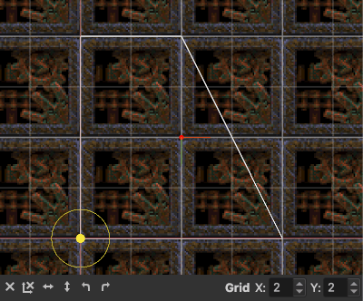

The material of the current face is shown in the background of the UV editor. The material is tiled, and the tiling edges are displayed in gray. These tiling edges are called the _UV grid_. The shape of the currently selected brush face is displayed in white. The yellow filled circle marks the origin of the material, and the two red lines that meet at the origin mark the origin axes of the material - these are used for scaling. The larger yellow circle is a handle used for rotating the material. The UV axes are displayed in red and green at the center of the brush face.

To change the offset of the material in relation to the brush face, you can just click and drag the material anywhere with the left mouse button. Note that the material will snap to the vertices of the brush face to make alignment easier.

You can scale the material by clicking and dragging the gray UV grid lines, which will also snap to the vertices of the brush face. Scaling is relative to the origin of the material, as marked by the yellow circle. To change the scaling origin, you can left click and drag the yellow circle, or you can left click and drag the red lines meeting at the origin. The lines allow you to set the X and Y coordinates of the origin separately. The origin snaps to the vertices of the face and to its center.

To rotate the material about the origin, left click and drag the large yellow circle, or hold #key(Ctrl) and left click and drag anywhere in the UV editor. The angle will snap to the edges of the brush face to make it easier to adjust it to the shape of the face.

Shearing the material is possible if the map uses a [parallel projection](#material_projection_modes). Shear by holding #key(Alt) while left clicking and dragging the gray UV grid lines.

At the bottom of the UV editor are the following controls:


- Reset alignment. All attributes are reset, and in [parallel projection](#material_projection_modes) format maps, the material is projected from the face plane. In standard format maps, acts the same as "Reset alignment to world aligned".
- Reset alignment to world aligned. All attributes are reset and the material is projected from an axial plane.
- Flip material horizontally
- Flip material vertically
- Rotate material 90 counterclockwise
- Rotate material 90 clockwise
- Grid controls for subdividing the UV grid. This can be useful to align part of a larger trim sheet to the face.

## Entity Properties {#entity_properties}

An entity is, essentially, a collection of properties, and a property is a key value pair where both the key and the value is a string. Some values have a special format, such as colors, points, or angles. But in general, if you are editing an entity, you will be working with strings. In TrenchBroom, you can add, remove, and edit entity properties using the entity property editor, which is located at the top of the entity inspector.


The entity property editor is split into two separate areas. At the top, there is a tabular representation of the properties of the currently selected entities and, if applicable, the defaults for those properties which are not present in the selected entities.

### Default Entity Properties {#entity_properties_defaults}

The default properties are shown in _italics_ below the actual properties of the selected entities. To hide the default properties, you can uncheck the checkbox at the bottom of the table. Default entity properties are defined in an entity definition file such as an FGD file, and their meaning depends on the game. Some games, like Quake, have builtin default values for entity properties, and the default entity properties reflect these defaults (if set up correctly in the entity definition file).

Other games such as Half Life don't provide default values for entity properties, and expect the defaults to be set explicitly for every entity. If configured in the [game configuration](#game_configuration_files_entities), then TrenchBroom will automatically instantiate the default entity properties (with default values) when a new entity is created. Note that not every default property will be instantiated by TrenchBroom - only those properties which have a default value configured in the entity definition file can be instantiated by TrenchBroom.


Below the entity property editor, there is a small button which pops up a menu when pressed. This menu has three entries:

- **Set existing default properties**: This resets all entity properties to their default values if they have one. No entity property is added or removed, and no entity property is changed unless it has a default value.
- **Set missing default properties**: This adds all default entity properties that aren't set. Only adds new entity properties. No entity property is removed and no existing entity property is changed.
- **Set all default properties**: This is a combination of the above. Every entity property having a default value is set to its default, regardless of its current value. Missing default properties are added. No entity properties are removed, and only default entity properties are changed.

### Editing Properties

To select an entity property, just click in the row that represents that property in the table. The clicked field will be highlighted, indicating that it has focus. The highlight indicates that you can change the field by entering text. In the screenshot above, the "mangle" property has been selected, and its value has focus, indicating that it is ready to be changed.

If you are changing a lot of properties, you may wish to navigate quickly through the table. You can use the cursor keys to move focus around in the table. Alternatively, you can hit #key(Tab) to move field by field. If the focus is on a key of some property, hitting tab will move the cursor the value field of that property, and hitting tab again will move it to the key field of the next property, and so on until you reach the end of the table. You can also move in the opposite direction by hitting #key(Shift)#key(Tab). #key(Return) moves vertically through the list, meaning that if focus is on a property key and you hit enter, focus will move to the key of the next property in the list. Use this navigation method to mass rename property keys, for example.

To change the key or the value of a property, set the focus to the appropriate field in the table. If you enter some text now, that text will replace the key of the property. An alternative way to change a field is to click on it while its property is already selected. This will show an actual text field in which you can enter the text.

There are several ways to add a property to an entity. First, you can click on the button with the "+" label at the bottom of the table. This will insert a new property with a default name and no value into the table. Second, you can hit #key(Ctrl)#key(Return) to add a new property. In both cases, the new property will be selected so that you can start editing its key and value right away as described above. Finally, you can add a property by changing the value of a default property. This will promote the default property to an actual property of the entity.

To remove entity properties, you should click the rows in the table that represent them and hit the button labeled "-" at the bottom of the table.

### Multiple Entity Selections

 If multiple entities are selected, the table will show the union of all their properties and not just those properties which all of the selected entities have in common. Properties which are not present in all of the selected entities have their names grayed out, and properties which have different values in those entities that actually have those properties are displayed with an empty value. In the screenshot, there are three light entities selected. Consequentially, the "classname" property is present in all of them and has the same value everywhere. Likewise, the "origin" property is present in all of these entities, but it has different values in each of them, so it is shown without a value. The "light", "wait", "angle", and "mangle" properties on the other hand are only present in some of the selected entities, but they do have the same values in each of the entities that have them.

If you change an entity property when multiple entities are selected, the change gets applied to all of the selected entities, even if that requires adding that property. So if you were to change the value of the "light" property in the example above to 200, each of the selected entities will subsequently have a "light" property with the value 200, even if only a subset of the selected entities had that property before.

### Smart Entity Property Editors

TrenchBroom provides special editors for the following entity properties: spawnflags, colors, and choices. These special editors are called _smart property editors_ and are displayed below the entity property table if you select an entity property for which such an editor exists.

Type             Editor                                                         Description
----             ------                                                         -----------
Spawnflags          A table of checkboxes which allow you to toggle the individual spawnflag values.
Color                    A color chooser control that allows you to convert between byte and float color values, and provides a list of all colors found in the map.
Choice                  A dropdown list of values. You can also enter any text into the text box.

### Linking Entities

Entities can be linked using special link properties. Each link has a source and a target entity. The target entity has a property called "targetname", and the value of that property is some arbitrary string. The source entity has a "target" or a "killtarget" property, and the value of that property is the value of the target entity's "targetname" property. To create an entity link, you have to manually set these properties to the proper values. Currently, the names of the link properties are hardcoded into TrenchBroom, but in the future they will be read from the FGD file if appropriate. The following section explains how entity links are visualized in the editor.

### Entity Link Visualization

Entity Links are rendered as lines in the 3D and 2D viewports. TrenchBroom provides you with four modes for entity link visualization. You can switch between these modes in the dropdown menu that is displayed when you click on the "View" button at the right of the info bar. The following table explains the four different modes.

Mode                   Description
----                   -----------
All                    Always show all entity links.
Transitive selected    Show all entity links connected to the selected entities, and any link that is reachable from the selected entities, too.
Direct selected        Show all entity links connected to the selected entities.
No                     Don't show any entity links.

An entity link that is connected to a currently selected entity is rendered as a red line that connects the selected entity with the source or target of that link. Other entity links are colored green.


In the screenshot above, the link between the two info_null entities is rendered in green because neither of the entities is selected.

## Undo and Redo {#undo_redo}

Almost everything that you do in TrenchBroom can be undone by choosing #menu(Menu/Edit/Undo). This applies to every action that somehow modifies the map file (such as moving objects), but it also applies to some actions that do not change the map file, such as selection, hiding, and locking. There is no limit to how many actions you can undo, and once an action is undone, you can redo it by choosing #menu(Menu/Edit/Redo).

### Undo Collation and Transactions

Note that TrenchBroom groups certain sequences of actions into transactions which can be undone and redone as one. For example, if you select a few objects and then hide them, the objects are automatically deselected. Both the action of deselecting the objects to be hidden and hiding them are grouped together into a transaction, so when you undo, the objects will be unhidden and reselected at the same time.

On top of that, TrenchBroom will merge sequences of the same action if they happen within one mouse drag or within a certain time. So if you move a brush around, all steps of the move will be merged into one action, or if you move a brush around by pressing the appropriate keyboard shortcuts within a certain time, all these actions will also be merged into one. In practice, this saves memory and it allows you to undo such sequences in one fell swoop.

# Keeping an Overview

If you are working on large maps, it can become cumbersome to manage the objects in the map and to keep an overview over them. Some areas may be crowded with a lot of brushes and entities so that it becomes difficult to edit a particular object that is occluded by other things. TrenchBroom provides you with a number of tools to easily keep an overview over your map and to remove clutter in crowded areas.

## Filtering {#filtering_rendering_options}

To filter out certain types of objects, you can open the view dropdown window by clicking on the "View" button at the right of the info bar above the editing area.


In the left of the view dropdown, there is a list of checkboxes that allows you to hide all entities that share the same entity definition (i.e., the same classname). Uncheck an entity definition (or a group thereof) to hide the respective entities. For quickly hiding and showing all entities, you can click on the two buttons below the list.

The right half of the view dropdown has several options, partitioned into three groups.

* **Entities** - here you can configure how entities are rendered in the editor.
* **Brushes** - allows you to toggle on or off certain special brush or face types. These types are game specific and are read from the [game configuration file](#game_configuration_files).
* **Renderer** - various options on how other objects are rendered.

Note that it is possible to add keyboard shortcuts to toggle every option in the view dropdown in the [preferences](#keyboard_shortcuts).

## Hiding and Isolation

If you are working on a crowded area, it can be useful to hide certain objects, or to hide everything but the objects of interest. To hide the selected objects, choose #menu(Menu/View/Hide), and to isolate the selected objects, choose #menu(Menu/View/Isolate). To show all hidden objects, choose #menu(Menu/View/Show All). All of these actions can be undone.

## Locking

Locking prevents objects from being selected or edited in anyway. Locked objects are rendered with blue edges and their faces are tinted in blue, as shown in the following screenshot.


Objects can be locked either if you are editing an open group or if you set a layer to locked (see below). You cannot lock objects individually.

## Groups {#groups}

Groups allow you to treat several objects as one and to give them a name. A group can contain the following types of objects: entities, brushes, and more groups. The fact that a group can contain groups induces a hierarchy - but in practice, you will rarely create such nested groups. In the viewports, groups have their bounding box rendered in blue, and their name is displayed above them.

To create a group, make sure that no tool is currently active and select some objects and choose #menu(Menu/Edit/Group). The editor will ask you for a name. Group names need not be unique, so you can have several groups with the same name. To select a group, you can click on any of the objects contained in it. This will not select the individual object, but the entire group, which is why you can only edit all objects within a group as one. If you want to edit individual objects in a group, you have to open the group by double clicking on it with the left mouse button. This will lock every other object in the map (locked objects are not editable and rendered in blue). Once the group is opened, you can edit the individual objects in it, or you can create new objects within the group in the usual ways. Once you are done editing the group, you can close it again by left double clicking anywhere outside of the group. Finally, you can remove a group by selecting it and choosing #menu(Menu/Edit/Ungroup). Note that removing a group does not remove the objects in the group from the map, the objects are merely ungrouped.

To add objects to an existing group, select the objects you wish to add to the group, then right click on an object already existing to that group and select "Add Objects to GROUPNAME", where GROUPNAME is the name of the group. Likewise, you can remove objects from a group by opening that group, selecting the objects you wish to remove from the group, and selecting "Remove Objects from GROUPNAME" from the [map view context menu](#map_view_context_menu). The removed objects are added to the current layer. If you remove all objects from a group, the group is deleted automatically.

## Linked Groups {#linked_groups}

Groups can also be linked together to allow a form of instancing. Linked groups contain the same objects, but can be transformed into different positions and shapes as a whole. Changing one of the linked groups will update all the other linked groups. Linked groups are useful to build reusable structures such as doorways that you want to keep in sync. The workflow for linked groups is always the same:

- Create some objects that form a reusable structure, e.g. a doorway.
- Group the objects.
- Select the group and create a linked duplicate via the context menu or by choosing #menu(Menu/Edit/Create Linked Duplicate) from the menu.
- Move the duplicate to its intended position and apply further transformations to it (e.g. rotation).
- Create more linked duplicates by duplicating a linked group in the usual way.
- At any time, open any of the linked groups and change its contents. These changes will then be replicated into the other linked groups.

You can apply various transformations to linked groups such as translation, rotation, scaling, or flipping. Groups and linked groups can be nested arbitrarily, so a linked group can contain a group, or a group can contain a linked group, and linked groups can even contain linked groups.

It is important not to think of linked groups as instancing. In TrenchBroom, there is no fixed "primary" version of the linked group that you create instances of. Indeed, linked groups are much simpler under the hood: When you change a linked group, that group will temporarily become the "primary" version and all of its contents are copied into all of its linked siblings, independent of whether or not the contained objects were changed. With this in mind, you may think of TrenchBroom performing a manual updating process automatically for you.

You can add objects to linked groups or remove objects from linked groups in the usual way, and the change is reflected in the linked groups immediately. To edit an object in a linked group, open the group as usual and perform your changes. Again, the changes are reflected in the linked groups immediately.

Consider the following example where you have two linked groups, each containing a brush and an entity.

```
Group A
- Brush A
- Entity A
  - "classname" "monster_army"
  - "angle" "90"
  - "origin" "0 0 0"

Group B (translated by 128 0 0)
- Brush B
- Entity B
  - "classname" "monster_army"
  - "angle" "90"
  - "origin" "128 0 0"
```

`Group B` is structurally identical to `Group A`, but it's translated by 128 units on the X axis. Suppose you change `Brush A` by moving one of its vertices. Then all contents of `Group A` are copied, translated by 128 on the X axis, and added to `Group B`, replacing its existing content. Or let's say you set `Entity B`'s spawnflags to `1`, then the same process happens, but this time `Group B`s content is copied, translated by -128 on the X axis, and finally `Group A`'s contents are replaced by the copies. The result would look as follows:

```
Group A
- Brush A
- Entity A
  - "classname" "monster_army"
  - "angle" "90"
  - "origin" "0 0 0"
  - "spawnflags" "1"

Group B (translated by 128 0 0)
- Brush B
- Entity B
  - "classname" "monster_army"
  - "angle" "90"
  - "origin" "128 0 0"
  - "spawnflags" "1"
```

There are some situations in which you might not want all of your changes to be reflected in all linked groups. For example, when building a door, you will usually hook the door brushes to a trigger brush using `target` and `targetname` properties. But of course, you want to use different names for different doors so that all doors don't open at once when one of them opens in the game. To allow these properties to have different values in different linked groups, you can protect entity properties against changes from their counterparts in a linked group.

### Protected Entity Properties {#protected_entity_properties}

Marking an entity property as protected blocks any changes to this property from the corresponding entity in a linked group. Furthermore, any changes to a protected entity property are not reflected in the corresponding entities in linked groups. Let's consider an example again.

```
Group A
- Entity A
  - "classname" "monster_army"
  - "angle" "90"
  - "origin" "0 0 0"
  - "spawnflags" "1"

Group B (translated by 128 0 0)
- Entity B
  - "classname" "monster_army"
  - "angle" "90"
  - "origin" "128 0 0"
  - "spawnflags" "1"
```

Let's assume you want to change `Entity B`'s angle, but you don't want this change to affect `Entity A`. In this case, you can set the `angle` property of `Entity B` to protected before changing its value to `180`. The result will look as follows.

```
Group A
- Entity A
  - "classname" "monster_army"
  - "angle" "90"
  - "origin" "0 0 0"
  - "spawnflags" "1"

Group B (translated by 128 0 0)
- Entity B
  - "classname" "monster_army"
  - "angle" "180" (protected)
  - "origin" "128 0 0"
  - "spawnflags" "1"
```

Note that `Entity A`'s `angle` property still has a value of 90. If you now change `Entity A`'s `angle` property, this change will not be reflected in `Entity B` either.

You can use the entity property editor in the entity inspector to protect entity properties. When editing an entity inside of a linked group, a new column with checkboxes appears like in the following screenshot.


To set a property to protected, click on its checkbox. To remove the protection, click on the checkbox again. When you set a property to unprotected, its value will be reset to the value of the corresponding unprotected properties in the other entities. In our example from above, Setting `Entity B`'s `angle` property to unprotected will reset its value to `90`, which is the value from `Entity A`'s unprotected `angle` property.

To set all properties of one or multiple entities to unprotected, select the entities (or their containing groups) and choose #menu(Menu/Edit/Clear Protected Properties).

Since all changes you make to a linked group are immediately replicated into the other linked groups, newly added properties show up in the linked groups right away. If you want to add a property without replicating it, you can add it as protected by clicking on the shielded `+` icon in the toolbar below the entity property editor (see previous screenshot). Conversely, if you want to suppress a property in a linked group, that is, you don't want it to be created when adding it to another linked group, you can add it as a protected property and immediately delete it again. It will still be shown in the property editor until you remove its protected checkmark, but the name will be in italics, so it will look like a default property.

To illustrate the value of these deleted protected properties, consider the following example.

```
Group A
- Entity A
  - "classname" "monster_army"
  - "origin" "0 0 0"

Group B (translated by 128 0 0)
- Entity B
  - "classname" "monster_army"
  - "origin" "128 0 0"

Group C (translated by 0 64 0)
- Entity C
  - "classname" "monster_army"
  - "origin" "0 64 0"
```

Suppose you want to set an angle for all of the `monster_army` entities except for `Entity A`. In this case, you would first add the `angle` property to `Entity A` as a protected property, and then delete it again from `Entity A`. Then you would add the `angle` property to `Entity B` and give it a value. This property would be replicated into `Entity C`, but not `Entity A` because there it is protected, even though the property isn't even present. In the following screenshot, the `angle` property has been set to protected and was then subsequently deleted. If you click its checkbox to remove the protection, the property will no longer show up in the entity property editor.


### Unlinking and Separating Linked Groups {#separating_linked_groups}

To unlink a linked group, select the group and choose #menu(Menu/Edit/Separate Linked Groups). This will turn the linked group into a regular group again. If you select multiple linked groups from a set of mutually linked groups, the selected groups will not be turned into regular groups, but rather they will become a separate set of linked groups. This separate set of linked groups is still mutually linked to each other, but they are no longer linked to the other, unselected members of the set.

Note that if you remove all members of a set of linked groups, either by separation or by deleting them, the single remaining member of the set will become a regular group.

### Visualization {#linked_group_visualization}


Linked groups are rendered with a different color than regular groups. If you select a linked group, the editor will render arrows emanating from the selected group and ending in the other linked groups to indicate which groups will be updated when the selected group changes. These arrows are still shown if you open a linked group.

### Linked Groups in the Map File {#linked_groups_map_file}

Like regular groups, linked groups are stored in the map file using `func_group` entities with additional, TrenchBroom specific properties. If you edit a map file with linked groups in another editor than TrenchBroom and you change objects belonging to a linked group, then that linked group is out of sync with its linked counterparts. TrenchBroom will load such groups without issue and you can keep editing them as usual. However, if you change one of the linked groups, then this group will overwrite the contents of all other linked groups, so afterwards they will be in sync again. So if you purposefully changed one of the linked groups in an external editor, and want to replicate these changes into the linked groups, just open this specific group in the editor, make change to it, and close the group again. This will update all of the linked groups and they will be in sync again.

Consider the following linked groups:

```
Group A
- Brush A
- Entity A
  - "classname" "monster_army"
  - "origin" "0 0 0"

Group B (translated by 128 0 0)
- Brush B
- Entity B
  - "classname" "monster_army"
  - "origin" "128 0 0"
```

In the map file, these groups would be stored as follows. Refer to the comments for information about the TrenchBroom specific properties for linked groups.

```
// entity 0
{
"classname" "func_group"
"_tb_type" "_tb_group"
"_tb_name" "group"
"_tb_id" "1"

// The following property is the ID of a set of linked groups.
// All groups with this linked group ID will be mutually linked.
"_tb_linked_group_id" "{38b3b39d-a165-4999-985d-d40563ce51c1}"

// The transformation that has been applied to the group as a whole.
// This will get updated when you transform a group by moving, rotating or scaling it.
"_tb_transformation" "1 0 0 128 0 1 0 0 0 0 1 0 0 0 0 1"

// brush 0
{
// faces omitted
}
}
// entity 1
{
"classname" "monster_army"
"origin" "128 0 0"
"_tb_group" "1"
}
// entity 2
{
"classname" "func_group"
"_tb_type" "_tb_group"
"_tb_name" "group"
"_tb_id" "2"

// This group entity has the same linked group ID as the previous one,
// so they will be linked.
"_tb_linked_group_id" "{38b3b39d-a165-4999-985d-d40563ce51c1}"

"_tb_transformation" "1 0 0 0 0 1 0 0 0 0 1 0 0 0 0 1"
// brush 0
{
// faces omitted
}
}
// entity 3
{
"classname" "monster_army"
"origin" "0 0 0"
"angle" "90"
"_tb_group" "2"
"_tb_protected_properties" "angle"
}
```

## Layers {#layers}

Layers decompose your map into several parts. For example, you might create a layer for separate rooms or areas. Layers can contain groups, entities, or brushes, and each of these objects can belong to one layer only. Each layer has a name and can be set to hidden or locked, or omitted from exported maps. Every map contains a "Default Layer" that cannot be removed.


The layer editor, part of the map inspector, displays all layers in your map.

- Omit a layer from export by clicking the hollow circle icon (the "X" indicates the layer is omitted from export)
- Hide or show a layer by clicking on the eye icon
- Lock or unlock a layer by clicking on the lock icon
- Create a new layer by clicking the plus button at the bottom of the layer list
- Remove one or more layers by selecting them and click on the minus button

New objects created from scratch or pasted from the clipboard are inserted into the current layer (unless you are working in a group). Objects created from other objects (e.g. by duplicating or extrusion) are inserted into the layer of the source object.

The current layer is indicated in the layer list by a radio button and by having its name in bold, and you can set the current layer by double clicking on a layer in the layer list.

Right click on a layer in the layer editor for the layer context menu:

- Make active layer
- Move selection to layer
- Select all in layer
- Hide layer
- Isolate layer
- Lock layer
- Omit from export
- Show all Layers
- Hide all Layers
- Unlock All Layers
- Lock All Layers
- Rename Layer
- Remove Layer

The [map view context menu](#map_view_context_menu) also has some layer related shortcuts.

# Preferences

The preferences dialog allows you to set the game configurations, to change the view layout and control the rendering, and to customize the mouse and the keyboard shortcuts. You can open the preferences dialog by choosing #menu(Menu/File/Preferences...). The dialog is split into four panes, each of which we will review in the following sections. Note that on Windows and Linux, the changes are only applied if you click the "OK" or "Apply" button at the bottom of the dialog, whereas on Mac OS X, the changes are applied immediately.

## Game Configuration {#game_configuration}

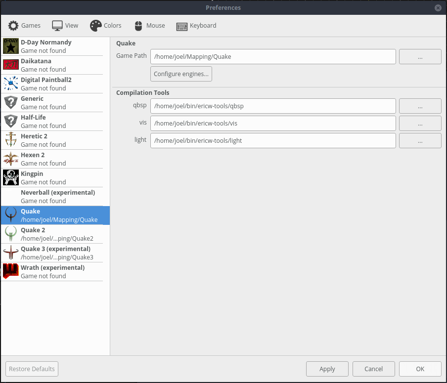

The game configuration preference pane is where you set up the paths to the games that TrenchBroom supports. For each game, you can set the game path by clicking on the "..." button and selecting the folder in which the game is stored on your hard drive. Alternatively, you can enter a path manually in the text box, but you have to hit #key(Return) to apply the change.

Additionally, you can configure the game engines for the selected game by clicking on the 'Configure engines...' button.

Clicking the folder icon below the game list opens the folder that contains custom game configurations in a file browser.

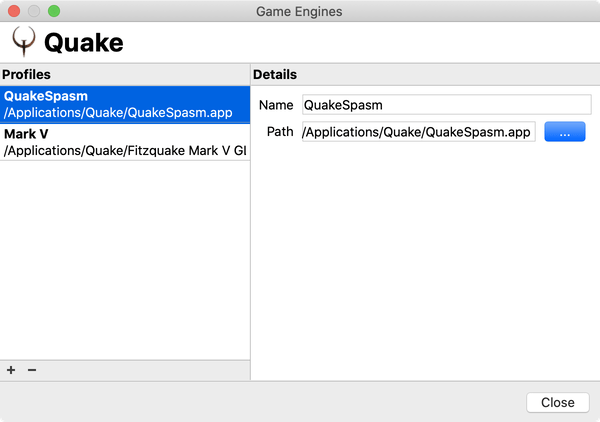

In this dialog, you can add a game engine profile by clicking on the '+' button below the profile list on the left, and you can delete the selected profile by clicking on the '-' button. To the right of the list, you can edit the details of the selected game engine profile, specifically its name and path. Similar to the game path, if you edit the engine path manually, you have to apply the changes by pressing #key(Return) while in the path text box. Click [here](#launching_game_engines) to find out how to launch game engines from within TrenchBroom.

For some game configurations (such as for Quake, shown above) you can also optionally enter paths for a set of compilation tools. If it's not clear what you should be specifying a path to here, then hovering over the path entry box may give you a tooltip with additional info about that compilation tool.

If you do enter a path here, then the name shown to the left of the path can be used as a variable in your [compilation profiles](#compiling_maps) for this game. Wherever that variable occurs, the path specified here will be used. For example if your path to the `qbsp` tool is `C:\mapping\ericw-tools-v0.18.1-win64\bin\qbsp.exe`, and you set that path here... then in your compilation profiles you can enter `${qbsp}` wherever you need to refer to that whole qbsp.exe path.

The benefits of specifying your tool paths here (if the game configuration allows) are:

- It will be easier to create, edit, and share your compilation profiles.
- If your tool paths need to be changed, you only have to change them here.

So in the example above, if you wanted to try a later version of ericw-tools that are located in a different folder like `C:\mapping\ericw-tools-v0.19-win64\bin`, then you would only need to change the paths in this dialog. You wouldn't need to edit all of your compilation profiles.

You can also add [custom game configurations](#game_configuration_files) to suit a particular setup (such as an engine supporting formats that TrenchBroom supports, but does not expect with that game).

## View Layout and Rendering {#view_layout_and_rendering}


In this preference pane, you can choose the layout of the editing area. There are four layouts available:

Layout      Description
------      -----------
One Pane    One cycleable 3D / XY / XZ / XY viewport
Two Panes   One 3D and one cycleable XY / XZ / XY viewport
Three Panes One 3D, one XY viewport and one cycleable XZ / YZ 2D viewport
Four Panes  One 3D, one XY viewport, one XZ viewport, and one YZ viewport

Cycleable 2D viewports can be cycled by pressing #action(Controls/Map view/Cycle map view).

The remaining settings affect how the viewports are rendered.

Setting                     Description
-------                     -----------
Brightness                  The brightness of the textures (affects the 3D viewport, the entity and the material browser)
Grid                        Opacity of the grid in the 3D and 2D viewports
Coordinate System Axes      Show the coordinate system axes in the 3D and 2D viewports
Filter Mode                 Texture filtering mode in the 3D viewport
Enable multisampling        Whether rendering is antialiased
Material Browser Icon Size  The size of the material icons in the material browser
Renderer Font Size          Text size in the map viewports (e.g. entity classnames)

## Mouse Input {#mouse_input}

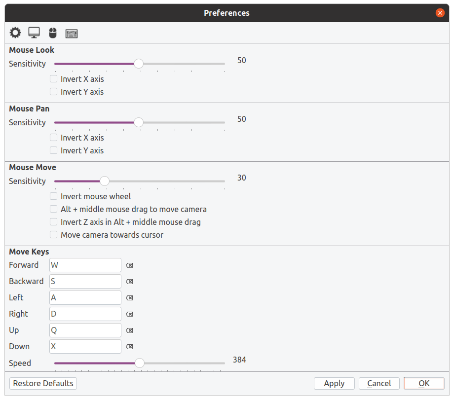

The mouse input preference pane allows you to change how TrenchBroom interprets mouse movements.

Setting     Description
-------     -----------
Mouse Look  Sensitivity and axis inversion for mouse look and orbiting (right click and drag)
Mouse Pan   Sensitivity and axis inversion for mouse panning (middle click and drag)
Mouse Move  Sensitivity and settings for moving the camera with the mouse. If you use a tablet, the setting "Alt+MMB drag to move camera" might make navigation easier for you.
Move Keys   Keyboard shortcuts for moving around in the map, with a separate slider to control the speed.

## Keyboard Shortcuts {#keyboard_shortcuts}

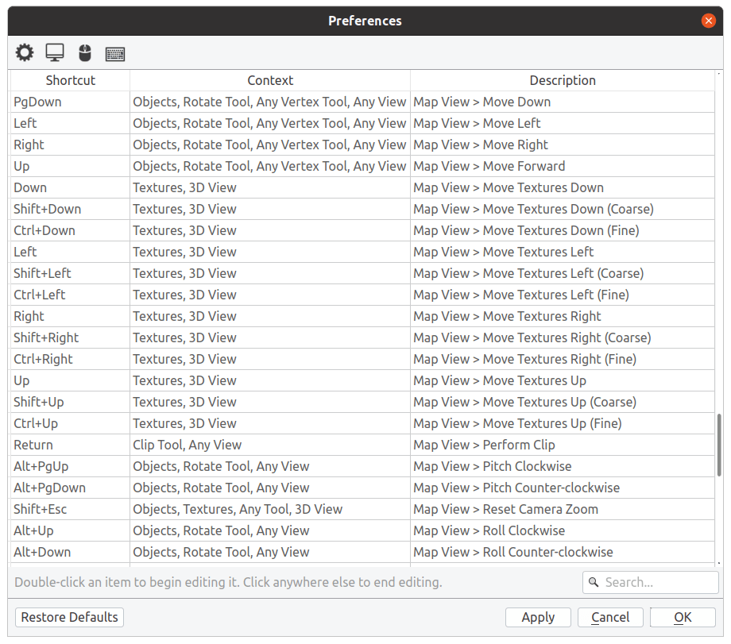

In this preference pane, you can change the keyboard shortcuts used in TrenchBroom. The table lists all available shortcuts, their context, and the description. To change a keyboard shortcut, click twice (do not double click) on the shortcut in the first column of the table and enter the new shortcut. The context determines when this shortcut is available, for example, the PgDn key triggers different actions depending on whether the rotate tool is active or not. Finally, the description column explains what a shortcut does in a particular context. Sometimes a shortcut triggers different actions depending on whether the viewport in which it was used is a 3D or a 2D viewport. For example, the PgDn key can move objects backward (away from the camera) in a 2D viewport or down along the Z axis in the 3D viewport. These different actions are listed together in the description column, but they are separated with a semicolon.

If you open the preference dialog when a map is currently opened, the list of shortcuts will contain additional entries depending on the loaded entity configuration file and the game configuration file. For each entity and special brush or face types, the following keyboard shortcuts are available.

* **Entity**
  - `View Filter > Toggle CLASSNAME visible` to toggle entities with this classname visible and invisible ([more info](#filtering_rendering_options))
  - `Create CLASSNAME` to create entities with this classname ([more info](#creating_entities))
* **Brush / Face Type**
  - `View Filter > Toggle TYPE visible` to toggle brushes or faces with this type visible and invisible ([more info](#filtering_rendering_options))
  - `Turn selection into TYPE` to set this type to the selected brushes or faces
  - `Turn selection into non-TYPE` to unset this type from the selected brushes or faces

Note that if you assign a keyboard shortcut to different actions in the same context, the shortcut creates a conflict and you cannot exit the preference pane or close the dialog until you resolve the conflict. Conflicting shortcuts are highlighted in red.

# Advanced Topics

## Command Repetition

Editing brushwork often consists of repeating the same steps over and over. As an example, consider building a spiral stair case. You start by cutting out a brush that represents one step of the stair case. Then you duplicate that brush, move it upward and rotate it about the center axis of the stair case. And the you repeat these actions for every step of the stairset. TrenchBroom has a feature called *command repetition* that is designed to automate some part of this process for you.

Repeating commands is similar to having an automatic Macro recorder. Remember that TrenchBroom already records everything you do to provide [undo and redo](#undo_redo). In addition to undoing your actions, TrenchBroom also uses the recorded information to allow you to repeat some of your most recently performed actions. In the example of the stairwell, you would want to repeat the duplication, the translation, and the rotation actions over and over with a single key stroke. The only problem is that you need to determine which of the most recently performed actions should be repeated. This is done in two ways. First, TrenchBroom automatically forgets all repeatable actions when the selection changes. So if you select some objects and choose #menu(Menu/Edit/Repeat) directly after selecting some objects, nothing will happen because all repeatable actions have been discarded. Second, you can tell TrenchBroom to discard all repeatable actions by choosing #menu(Menu/Edit/Clear Repeatable Commands). Think of this as telling TrenchBroom to start a new macro.

So in the case of the spiral stairwell, you would first create the brush that represents one stair. Since you don't want to repeat whatever actions you performed to create this brush, you'll have tell TrenchBroom to discard all repeatable commands, either by deselecting and then reselecting the brush, or by choosing the appropriate command from the menu. After that, you duplicate the brush, move it upwards, and rotate it. Then, you can repeat these steps by choosing #menu(Menu/Edit/Repeat) as often as you want.

In summary, you can think of command repetition as a very simple macro system that allows you to have one macro that consists only of the most recently performed actions. Even though it is quite limited, it can make your life a lot easier if you get used to it.

## Issue Browser {#issue_browser}

The issue browser is located at the bottom of the window. It contains a live list of issues that TrenchBroom has detected in your map. The list is live in the sense that the editor updates it automatically whenever the map changes. Be aware that TrenchBroom cannot detect all issues that may lead to compilation errors or warnings, or strange behavior in game. But it can detect some of these issues, and keeping the map free of such issues can protect you from having to spend a lot of time fixing bugs later on when your map becomes more complex. To see which types of issues TrenchBroom can detect and fix for you, click on the "Filter" button at the top right of the issue browser. This opens a dropdown list where you can toggle which types of issues TrenchBroom should check in your map. By default, all issues are enabled.

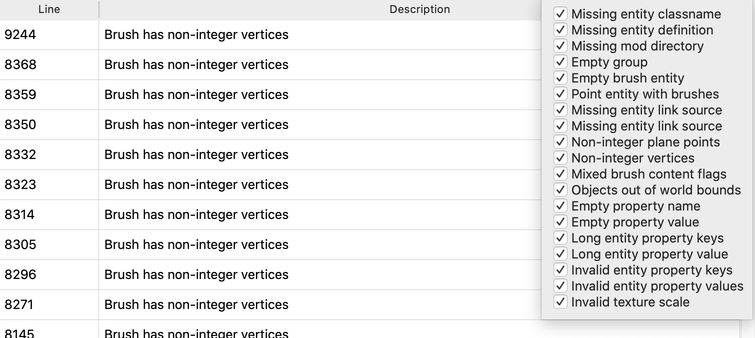

Every entry in the issue list provides you with to pieces of information: the line number, if applicable, where the problematic object is located in the current map file, and a description. If you wish to find an object that caused an issue, you can select that issue in the browser to have the object(s) selected in the editor. Next you can choose #menu(Menu/View/Camera/Focus on Selection) to make them visible in the 3D and 2D viewports.

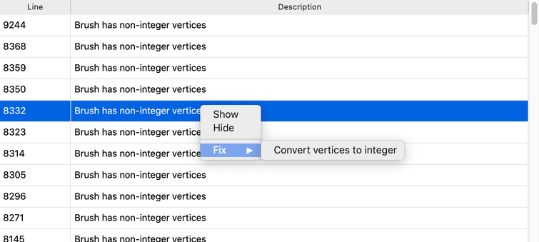

In addition to making you aware of issues, TrenchBroom can also fix them for you. To fix an issue, right click it and choose the appropriate fix from the "Fix" context menu. If you wish to ignore a particular issue, you can also tell TrenchBroom to hide it by choosing "Hide" in the context menu. If you wish to see all hidden issues, you can check the respective checkbox above the issue list. To make a hidden issue visible again, first show all hidden issues, then right click the issue and choose "Show" from the context menu.

## Compiling Maps {#compiling_maps}

TrenchBroom supports compiling your maps from inside the editor. This means that you can create compilation profiles and configure those profiles to run external compilation tools for you. Note however that TrenchBroom does not come with prepackaged compilation tools - you'll have to download and install those yourself. The following screenshot shows the compilation dialog that comes up when choosing #menu(Menu/Run/Compile...).


This dialog allows you to create compilation profiles, which are listed on the left of the dialog. Each compilation profile has a name, a working directory, and a list of tasks. Click the '+' button below the profile list to create a new compilation profile, or click the '-' button to delete the selected profile. To duplicate a profile, right click on it and select "Duplicate" from the menu. If you select a profile, you can edit its name, working directory, and tasks on the right side of the dialog.

Name
:    The name of this compilation profile. Need not be unique and can even be empty.

Working directory
:   A working directory for the compilation profile. This is optional, but very useful because it can be referred to as a variable when specifying the parameters of each task (see below). Variables are allowed (see below).

Tasks
:   A list of tasks which are executed sequentially when the compilation profile is run.

The checkbox on each task lets you selectively exclude a task from running when you run the compilation profile.

There are three types of tasks, each with different parameters:

Export Map
:    Exports the map to a file. This file should be different from the actual file where the map is stored.

    Layers marked "Omit From Export" will not be present in the exported map.

    Parameter   Description
    ---------   -----------
    Target      The path of the exported file. Variables are allowed.

Run Tool
:    Runs an external tool and captures its output. Note that for the Tool parameter's value, you can use a compilation tool variable defined in the [game configuration](#game_configuration), as discussed below.

    Parameter   Description
    ---------   -----------
    Tool        The absolute path to the executable of the tool that should be run. The working directory is set to the profile's working directory if configured. Variables are allowed.
    Parameters  The parameters that should be passed to the tool when it is executed. Variables are allowed.

Copy Files
:    Copies one or more files.

    Parameter   Description
    ---------   -----------
    Source      The file(s) to copy. To specify more than one file, you can use wildcards (*,?) in the filename. Variables are allowed.
    Target      The directory to copy the files to. The directory is recursively created if it does not exist. Existing files are overwritten without prompt. Variables are allowed.

Rename File
:    Renames or moves one file.

    Parameter   Description
    ---------   -----------
    Source      The file to rename or move. Wildcards are not supported. Variables are allowed.
    Target      The new path for the file. The path must end in a filename. The containing directory is recursively created if it does not exist. Existing files are overwritten without prompt. Variables are allowed.

Delete Files
:    Deletes one or more files.

    Parameter   Description
    ---------   -----------
    Target      The file(s) to delete. To specify more than one file, you can use wildcards (*,?) in the filename. Variables are allowed.

You can use [expressions](#expression_language) when specifying the working directory of a profile and also for the task parameters. The following table lists the available variables, their scopes, and their meaning. A scope of 'Tool' indicates that the variable is available when specifying tool parameters. A scope of 'Workdir' indicates that the variable is only available when specifying the working directory. Note that TrenchBroom helps you to enter variables by popping up an autocompletion list.

Variable         Scope             Description
--------         -----             -----------
`WORK_DIR_PATH`  Tool              The full path to the working directory.
`MAP_DIR_PATH`   Tool, Workdir     The full path to the directory where the currently edited map is stored.
`MAP_BASE_NAME`  Tool, Workdir     The base name (without extension) of the currently edited map.
`MAP_FULL_NAME`  Tool, Workdir     The full name (with extension) of the currently edited map.
`GAME_DIR_PATH`  Tool, Workdir     The full path to the current game as specified in the game preferences.
`MODS`           Tool, Workdir     An array containing all enabled mods for the current map.
`APP_DIR_PATH`   Tool, Workdir     The full path to the directory containing the TrenchBroom application binary.
`CPU_COUNT`      Tool              The number of CPUs in the current machine.

If the [game configuration](#game_configuration) for the current game includes compilation tools, then the names of those tools are also available as variables in the Tool scope. The following screenshot is a section of a compilation profile showing the use of such variables.


It is recommended to use the following general process for compiling maps and to adapt it to your specified needs:

1. Set the working directory to `${MAP_DIR_PATH}`.
2. Add an *Export Map* task and set its target to `${WORK_DIR_PATH}/${MAP_BASE_NAME}-compile.map`.
3. Add *Run Tool* tasks for the compilation tools that you wish to run. Use the expressions `${MAP_BASE_NAME}-compile.map` and `${MAP_BASE_NAME}.bsp` to specify the input and output files for the tools. Since you have set a working directory, you don't need to specify absolute paths here.
4. Finally, add a *Copy Files* task and set its source to `${WORK_DIR_PATH}/${MAP_BASE_NAME}.bsp` and its target to `${GAME_DIR_PATH}/${MODS[-1]}/maps`. This copies the file to the maps directory within the last enabled mod.

The last step will copy the bsp file to the appropriate directory within the game path. You can add more *Copy Files* tasks if the compilation produces more than just a bsp file (e.g. lightmap files). Alternatively, you can use a wildcard expression such as `${WORK_DIR_PATH}/${MAP_BASE_NAME}.*` to copy related files.

To run a compilation profile, click the 'Run' button in the compilation dialog. Note that the 'Run' button changes into a 'Stop' button once the compilation profile is running. If you click on this button again, TrenchBroom will terminate the currently running tool. A running compilation will also be terminated if you close the compilation dialog or if you close the main window, but TrenchBroom will ask you before this happens. Note that the compilation tools are run in the background. You can keep working on your map if you wish.

If you want to test your compilation profile without actually running it, click the 'Test' button. A test run will only print what each task will do without actually executing it.

Once the compilation is done, you can launch a game engine and check out your map in the game. The following section explains how you can configure game engines and launch them from within the editor.

## Launching Game Engines {#launching_game_engines}

Before you can launch a game engine in TrenchBroom, you have to make your engine(s) known to TrenchBroom. You can do this by bringing up the game engine profile dialog either from the launch dialog (see below) or from the [game configuration](#game_configuration).

There are two ways to launch a game engine from within TrenchBroom. Either click the 'Launch' button in the compilation dialog or choose #menu(Menu/Run/Launch...). This brings up the launch dialog shown in the following screenshot.

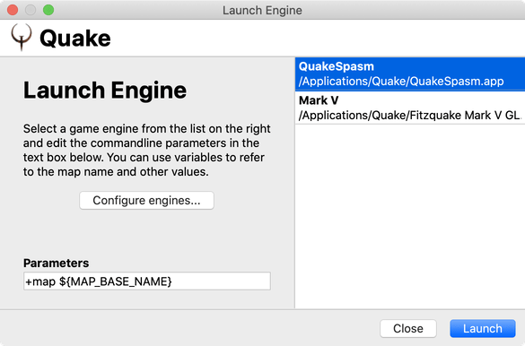

In this dialog, you can select the game engine of choice, edit its parameters, and launch the engine. To select an engine, click on it in the list on the right hand side of the dialog. If you wish to edit the list of engines, you can bring up the game engine profile dialog by clicking on the 'Configure engines...' button. You can then edit its parameters in the text box at the bottom of the left hand side of the dialog. Note that you can use the following variables in this text box:

Variable         Description
--------         -----------
`MAP_BASE_NAME`  The base name (without extension) of the currently edited map.
`GAME_DIR_PATH`  The full path to the current game as specified in the game preferences.
`MODS`           An array containing all enabled mods for the current map.

The `MODS` variable is useful to pass a parameter to the engine to choose a mod. Usually, this will be the last mod in the mods for the current map. Since the `MODS` variable is an array that contains all mods for the map, its individual entries are accessed using the subscript operator (see below). To access the last entry in the array, you can use the expression `$MODS[-1]`.

Note that the parameters are stored with the game engine profile.

## Expression Language {#expression_language}

TrenchBroom contains a simple expression language that can be used to easily embed variables and more complex expressions into strings. Currently, the language is mainly used in the Compilation dialog and the Launch Engine dialog. In the following, we will introduce the syntax and the semantics of the expression language.

### Evaluation

Every expression can be evaluated to a value. For example, the string `"This is a string."` is a valid expression that will be evaluated to a value of type `String` containing the string `This is a string.`. The expression language defines the following types.

Type       Description
----       -----------
Boolean    A value of this type can either be true or false.
String     A string of characters.
Number     A floating point number.
Array      An array is a list of values.
Map        A map is a list of key-value pairs. Synonyms: dictionary, table.
Range      The range type is only used internally.
Null       The type of `null` values.
Undefined  The type of undefined values.

#### Type Conversion {#el_type_conversion}

The following matrix describes the possible type conversions between these types. The first column contains the source type, while the following columns describe how a type conversion takes place, or if the result is an error. Note that the columns for types `Range`, `Null`, and `Undefined` are omitted because not type can be converted to these types (except for the trivial conversions). Converting a value of a some type `X` to the same type is called _trivial_.

-----------------------------------------------------------------------------------------------------------------------------
            `Boolean`                     `String`               `Number`                      `Array`     `Map`
----        ----------------------------- ---------------------- ----------------------------- ----------- ---------
`Boolean`   _trivial_                     `"true"` or `"false"`  `1.0` or `0.0`                error       error

`String`    `false` if value is `"false"` _trivial_              `0.0` if blank, number        error       error
            or `""`, `true` otherwise                            representation if possible,
                                                                 error otherwise

`Number`    `false` if value is `0.0`,    string representation, _trivial_                     error       error
            `true` otherwise              e.g. "1.0"

`Array`     error                         error                  error                         _trivial_   error

`Map`       error                         error                  error                         error       _trivial_

`Range`     error                         error                  error                         error       error

`Null`      `false`                       `""` (empty string)    `0.0`                         empty array empty map

`Undefined` error                         error                  error                         error       error
-----------------------------------------------------------------------------------------------------------------------------

A string value can be converted to a number value if and only if the string is a number literal (see below). Conversely, any number can always be converted to a string value, and the number is formatted as follows. If the number is integer, then only the decimal part and no fractional part will be added to the string. If the number is not integer, the fractional part will be formatted with a precision of 17 places.

### Expressions and Terms

Every expression is made of one single term. A term is something that can be evaluated, such as an addition (`7.0 + 3.0`) or a variable (which is then evaluated to its value).

    Expression     = GroupedTerm | Term
    GroupedTerm    = "(" Term ")"
    Term           = SimpleTerm | Switch | CompoundTerm

    SimpleTerm     = Name | Literal | Subscript | UnaryTerm | GroupedTerm
    CompoundTerm   = AlgebraicTerm | LogicalTerm | ComparisonTerm | Case

    UnaryTerm      = Plus | Minus | LogicalNegation | BinaryNegation
    AlgebraicTerm  = Addition | Subtraction | Multiplication | Division | Modulus
    LogicalTerm    = LogicalAnd | LogicalOr
    BinaryTerm     = BinaryAnd |BinaryXor | BinaryOr | BinaryLeftShift | BinaryRightShift
    ComparisonTerm = Less| LessOrEqual | Equal | Inequal | GreaterOrEqual | Greater

### Names and Literals

A name is a string that begins with an alphabetic character or an underscore, possibly followed by more alphanumeric characters and underscores.

    Name = ( "_" | Alpha ) { "_" | Alpha | Numeric }

`MODS`, `_var1`, `_123` are all valid names while `1_MODS`, `$MODS`, `_$MODS` are not. When an expression is evaluated, all variable names are simply replaced by the values of the variables they reference. If a value is not of type `String`, it will be converted to that type. If the value is not convertible to type `String`, then an error will be thrown.

A literal is either a string, a number, a boolean, an array, or a map literal.

    Literal = String | Number | Boolean | Array | Map

    Boolean = "true" | "false"
    String  = """ { Char } """ | "'" { Char } "'"
    Number  = Numeric { Numeric } [ "." Numeric { Numeric } ]

Note that strings can either be enclosed by double or single quotes, but you cannot mix these two styles. If you enclose a string by double quotes, you need to escape all literal double quotes within the string with backslashes like so: "this is a \\"fox\\"", but this is not necessary when using single quotes to enclose that string: 'this is a "fox"' is also a valid string literal.

Further note that number literals need not contain a fractional part and can be written like integers, i.e. `1` instead of `1.0`.

Array literals can be specified by giving a comma-separated list of expressions or ranges enclosed in brackets.

    Array      = "[" [ ExpOrRange { "," ExpOrRange } ] "]"
    ExpOrRange = Expression | Range
    Range      = Expression ".." Expression

An array literal is a possibly empty comma-separated list of expressions or ranges. A range is a special type that represents a range of integer values. Ranges are specified by two expressions separated by two dots. A range denotes a list of number values, so both expressions must evaluate to a value that is convertible to type `Number`. The first expression denotes the starting value of the range, and the second expression denotes the ending value of the range, both of which are inclusive. The range `1.0..3.0` therefore denotes the list `1.0`, `2.0`, `3.0`. Note that the starting value may also be greater than the ending value, e.g. `3.0..1.0`, which denotes the same list as `1.0..3.0`, but in the opposite order.

The following table gives some examples of valid array literal expressions.

Expression   Value
----------   -----
`[]`         An empty array.
`[1,2,3]`    An array containing the values `1.0`, `2.0`, and `3.0`.
`[1..3]`     An array containing the values `1.0`, `2.0`, and `3.0`.
`[1,2,4..6]` An array containing the values `1.0`, `2.0`, `4.0`, `5.0`, and `6.0`.
`[1+1,3.0]`  An array containing the values `2.0` and `3.0`.
`[-5,-1]`    An array containing the values `-5.0`, `-4.0`, ..., `-1.0`.

A map is a comma-separated list of of key-value pairs, enclosed in braces. Note that keys are strings or names. To use certain special characters or whitespace in the key, it must be given as a string. The value is separated from the key by a colon character.

    Map          = "{" [ KeyValuePair { "," KeyValuePair } ] "}"
    KeyValuePair = StringOrName ":" Expression
    StringOrName = String | Name

An example of a valid map expression looks as follows:

    {
      "some key":  "a string",
      other_key:   1+2,
      another_key: [1..3]
    }

This expression evaluates to a map containing the value `"a string"` under the key `some key`, the value `3.0` under the key `other_key`, and an array containing the values `1.0`, `2.0`, and `3.0` under the key `another_key`.

### Subscript

Certain values such as strings, arrays, or maps can be subscripted to access some of their elements.

    Subscript     = SimpleTerm "[" ExpOrAnyRange { "," ExpOrAnyRange } "]"
    ExpOrAnyRange = ExpOrRange | AutoRange
    AutoRange     = ".." Expression | Expression ".."

A subscript expression comprises of two parts: The expression that is being indexed and the indexing expression. The former can be any expression that evaluates to a value of type `String`, `Array` or `Map`, while the latter is a list of expressions or ranges. Depending of the type of the expression being subscripted, only certain values are allows as indices. The following sections explain which types of indexing values are permissible for the three subscriptable types.

#### Subscripting Strings

The following table explains the permissible indexing types and their effects.

Index    Effect
-----    ------
`Number` Returns a string containing the character at the specified index or the empty string if the index is out of bounds. Negative indices are allowed.
`Array`  Returns a string containing the characters at the specified indices. Assumes that all elements of the array are convertible to `Number`. Indices that are out of bounds are ignored, but negative indices are allowed.

If an index value is of type `Number`, it is rounded towards the closest integer towards `0`, that is, the value `1.7` is rounded down to `1`, while the value `-2.3` is rounded up to `-2`. String subscripts are very powerful because they allow multiple subscript index values and even negative indices. Here are some examples for using string subscripts.

    "This is a test."[0]  // "T"
    "This is a test."[1]  // "h"

Multiple indices, or array indices, can be used to extract substrings. Range expressions are a shorter way of extracting substrings.

    "This is a test."[0, 1, 2, 3] // "This"
    "This is a test."[0..3]       // "This"
    "This is a test."[5..6]       // "is"

You can even use multiple range expressions in a subscript, and you can combine range expressions and single indices, too.

    "This is a test."[0..3, 5..6]    // "Thisis"
    "This is a test."[0..3, 5..6, 8] // "Thisisa"

Negative indices can be used to extract a string suffix. Note that the index value `-1` accesses the last character of the array, the value `-2` accesses the last but one character, and so on. Assuming that the string that is being subscripted has a length of `7`, then the value `-7` accesses the string's first character.

    "This is a test."[-1]     // "."
    "This is a test."[-5..-2] // "test"

You can even reverse strings using subscripts and ranges.

    "This is a test."[14..0] // .tset a si sihT

Auto ranges are special constructs that are only permissible in subscript expressions. An auto range is a range where the start or end is unspecified. The unspecified side of an auto range is automatically replaced by the length of the string minus one.

    "This is a test."[..0] // .tset a si sihT
    "This is a test."[5..] // "is a test."

#### Subscripting Arrays

The following table explains the permissible indexing types and their effects.

Index    Effect
-----    ------
`Number` Returns the value at the specified index. An error is thrown if an the index is out of bounds. Negative indices are allowed. The same rounding rules as for string subscripts are applied.
`Array`  Returns an array containing the values at the specified indices. Assumes that all elements of the indexing array are convertible to `Number`. If the indexing array contains an index that is out of bounds, an error is thrown. Negative indices are allowed.

Just like string subscripts, array subscripts are very powerful because they allow multiple subscript index values and even negative indices. For the following examples, assume that the variable `arr` is the following array:

    [ 7, 8, 9, "test", [ 10, 11, 12 ] ]

Simple subscripting with integer indices behaves as expected:

    arr[0] // 7
    arr[3] // "test"
    arr[4] // [10, 11, 12]

Multiple indices, or array indices, can be used to extract sub arrays. Range expressions are a shorter way of extracting sub arrays.

    arr[0, 1, 2, 3] // [ 7, 9, 9, "test" ]
    arr[0..3]       // [ 7, 9, 9, "test" ]
    arr[3..4]       // [ "test", [ 10, 11, 12 ] ]

You can even use multiple range expressions in a subscript, and you can combine range expressions and single indices, too.

    arr[0..1, 3..4] // [ 7, 8, "test", [ 10, 11, 12 ] ]
    arr[0..3, 4]    // [ 7, 8, 9, "test", [ 10, 11, 12 ] ]

Negative indices can be used to extract an array suffix. Note that the index value `-1` accesses the last element of the array, the value `-2` accesses the last but one element, and so on. Assuming that the array that is being subscripted has a length of `7`, then the value `-7` accesses the array's first element.

    arr[-2]     // "test"
    arr[-2..-1] // [ "test", [ 10, 11, 12 ] ]

You can even reverse arrays using subscripts and ranges.

    arr[4..0] // [ [ 10, 11, 12 ], "test", 9, 8, 7 ]

Auto ranges are special constructs that are only permissible in subscript expressions. An auto range is a range where the start or end is unspecified. The unspecified side of an auto range is automatically replaced by the length of the array minus one.

    arr[..0] // [ [ 10, 11, 12 ], "test", 9, 8, 7 ]
    arr[3..] // [ "test", [ 10, 11, 12 ] ]

Since arrays can contain other subscriptable values such as strings, arrays, and maps, you can use multiple subscript expressions to access nested elements.

    arr[3][2..3] // "st"
    arr[4][1]    // 11

#### Subscripting Maps

The following table explains the permissible indexing types and their effects.

Index    Effect
-----    ------
`String` Returns the value under the given key or the special value `undefined` if the map being indexed does not contain the given key.
`Array`  Returns a map containing the key-value pairs with the given keys. Assumes that all elements of the indexing array are of type `String`. Keys that are not contained in the map being indexed are ignored.

For the following example, assume that the value of variable `map` is the following map:

    {
      "some number": 1.0,
      "some string": "test",
      "some array" : [ 1, 2, 3, 4 ],
      "some map"   : { "key1": 5, "key2": "asdf" }
    }

We begin with simple indexing using strings:

    map["some number"] // 1.0
    map["some array"]  // [ 1, 2, 3, 4 ]
    map["missing key"] // undefined

Multiple indices, or array indices, can be used to extract sub maps. Range expressions are not available for map subscripts because the generate lists of numbers and maps require the indexing values to be of type `String`. Indexing values that are not present in the map are ignored.

    map["some number", "some string"] // { "some number": 1.0, "some string": "test" }
    map["some number", "missing"]     // { "some number": 1.0 }

Like arrays, maps can contain other subscriptable values such as strings, arrays, and maps. You can use multiple subscript expressions to access nested elements.

    map["some array"][1]          // 2
    map["some map"]["key2"]       // "asdf"
    map["some map"]["key2"][1..3] // "ey2"

### Unary Operator Terms

A unary operator is an operator that applies to a single operand. In TrenchBroom's expression language, there are four unary operators: unary plus, unary minus, logical negation, and binary negation.

    Plus            = "+" SimpleTerm
    Minus           = "-" SimpleTerm
    LogicalNegation = "!" SimpleTerm
    BinaryNegation  = "~" SimpleTerm

The following table explains the effects of applying the unary operators to values depending on the type of the values.

-------------------------------------------------------------------------------------------------------
Operator         `Boolean`         `String`     `Number`     `Array` `Map`   `Range` `Null`  `Undefined`
--------          ----              ----         ----         ----    ----    ----    ----    ----
`Plus`            convert to number see below    no effect    error   error   error   error   error

`Minus`           convert to number see below    negate value error   error   error   error   error
                  and negate value

`LogicalNegation` invert value      error        error        error   error   error   error   error

`BinaryNegation`  error             see below    invert bits  error   error   error   error   error
-------------------------------------------------------------------------------------------------------

Note on using applying a unary operator to a value of type `String`: Every operator except `LogicalNegation` will try to convert a value of type `String` to a number if possible.

Some examples of using unary operators follow.

    +1.0   //  1.0
    -1.0   // -1.0
    -'1'   // -1.0
    +true  //  1.0
    -true  // -1.0
    !true  // false
    !false // true
    ~1     // -2
    ~-2    // 1
    ~'-2'  // 1

### Binary Operator Terms

A binary operator is an operator that takes two operands. Binary operators are specified in infix notation, that is, the first operator is specified first, then the operator symbol, and finally the second operator. Note that in the following EBNF notation for binary operators, the second operator is always an expression.

#### Algebraic Terms

Algebraic terms are terms that use the binary operators `+`, `-`, `*`, `/`, or `%`.

    Addition       = SimpleTerm "+" Expression
    Subtraction    = SimpleTerm "-" Expression
    Multiplication = SimpleTerm "*" Expression
    Division       = SimpleTerm "/" Expression
    Modulus        = SimpleTerm "%" Expression

All of these operators can be applied to operands of type `Boolean` or `Number`. If an operand is of type `Boolean`, it is converted to type `Number` before the operation is applied.

If one of the operators is of type `Boolean` or `Number` and the other operand is of type `String`, and its value can be converted to a number, then the operand can be applied, and the operand of type `String` is also converted to type `Number`.

    "1.23" + 1 // 2.23
    1.23 + "1" // 2.23
    "1" + "2"  // 12, see below

In addition, the `+` operator can be applied if both operands are of type `String`, if both are of type `Array`, or if both are of type `Map`.

    "This is" + " " + "test." // "This is a test."
    [ 1, 2, 3 ] + [ 3, 4, 5 ] // [ 1, 2, 3, 3, 4, 5 ]

In the previous two examples, the operands are simply concatenated. If both operands are of type `Map` however, the two maps are merged, that is, duplicate keys are overwritten by the values in the second operand:

    { 'k1': 1, 'k2': 2, 'k3': 3 } + { 'k3': 4, 'k4': 5 } // { 'k1': 1, 'k2': 2, 'k3': 4, 'k4': 5 }

Note that the value under key `'k3'` is `4` and not `3`!

#### Logical Terms

Logical terms can be applied to if both operands are of type `Boolean`. If one of the operands is not of type `Boolean`, an error is thrown.

    LogicalAnd = SimpleTerm "&&" Expression
    LogicalOr  = SimpleTerm "||" Expression

The following table shows the effects of applying the logical operators.

Left     Right   &&      ||
-------- ------- ----    ----
`true`   `true`  `true`  `true`
`true`   `false` `false` `true`
`false`  `true`  `false` `true`
`false`  `false` `false` `false`

#### Binary Terms

Binary terms manipulate the bit representation of operands of type `Number`. Note that, since manipulating the bit representation of a floating point number does not make much sense, the operands are converted to an integer representation first by omitting their fractional portion. If either of the operands is not of type `Number`, the operand is converted to type `Number` according to the [type conversion rules](#el_type_conversion).

    BinaryAnd        = SimpleTerm "&" SimpleTerm
    BinaryXor        = SimpleTerm "|" SimpleTerm
    BinaryOr         = SimpleTerm "^" SimpleTerm
    BinaryShiftLeft  = SimpleTerm "<<" SimpleTerm
    BinaryShiftRight = SimpleTerm ">>" SimpleTerm

Here are some examples of the operators in use:

    1 & 0  // 0
    1 | 0  // 1
    3 & 1  // 1
    2 | 1  // 3
    1 ^ 1  // 0
    1 ^ 0  // 1
    3 ^ 1  // 2
    1 << 1 // 2
    2 >> 1 // 1

#### Comparison Terms

Comparison operators always return a boolean value depending on the result of the comparison.

    Less           = SimpleTerm "<"  Expression
    LessOrEqual    = SimpleTerm "<=" Expression
    Equal          = SimpleTerm "==" Expression
    InEqual        = SimpleTerm "!=" Expression
    GreaterOrEqual = SimpleTerm ">=" Expression
    Greater        = SimpleTerm ">"  Expression

 Left        Right      Effect
------      -------     ------
`Boolean`   `Boolean`   `true` is greater than `false`
`Boolean`   `Number`    Convert right to `Boolean` and compare.
`Boolean`   `String`    Convert right to `Boolean` and compare.
`Boolean`   `Array`     error
`Boolean`   `Map`       error
`Boolean`   `Range`     error
`Boolean`   `Null`      Left is greater than right.
`Boolean`   `Undefined` Left is greater than right.
`Number`    `Boolean`   Convert left to `Boolean` and compare.
`Number`    `Number`    Compare as numbers.
`Number`    `String`    Convert right to `Number` and compare.
`Number`    `Array`     error
`Number`    `Map`       error
`Number`    `Range`     error
`Number`    `Null`      Left is greater than right.
`Number`    `Undefined` Left is greater than right.
`String`    `Boolean`   Convert left to `Boolean` and compare.
`String`    `Number`    Convert left to `Number` and compare.
`String`    `String`    Compare lexicographically (case sensitive).
`String`    `Array`     error
`String`    `Map`       error
`String`    `Range`     error
`String`    `Null`      Left is greater than right.
`String`    `Undefined` Left is greater than right.
`Array`     `Boolean`   error
`Array`     `Number`    error
`Array`     `String`    error
`Array`     `Array`     Compare lexicographically.
`Array`     `Map`       error
`Array`     `Range`     error
`Array`     `Null`      Left is greater than right.
`Array`     `Undefined` Left is greater than right.
`Map`       `Boolean`   error
`Map`       `Number`    error
`Map`       `String`    error
`Map`       `Array`     error
`Map`       `Map`       Compare key-value pairs lexicographically (key first, then value).
`Map`       `Range`     error
`Map`       `Null`      Left is greater than right.
`Map`       `Undefined` Left is greater than right.
`Range`     Any type    error
`Null`      `Null`      Both are equal.
`Null`      `Undefined` Both are equal
`Null`      Any type    Right is greater than left.
`Undefined` `Null`      Both are equal.
`Undefined` `Undefined` Both are equal
`Undefined` Any type    Right is greater than left.

The following examples show the comparison operators in action with different operand types. Assume that all expressions evaluate to `true` unless otherwise stated in comments.

    true > false
    true == true
    false == false

    true == "true"
    true == "True"
    true == "asdf"
    true != ""
    true != "false"
    true == "False"
    true == 1
    true == 2
    true != 0

    1 == "1"
    1 == "1.0"
    1 < "2"
    1 == "asdf" // throws an error because "asdf" cannot be converted to Number

    "asdf" == "asdf"
    "asdf" < "bsdf"

    null == null
    null == undefined
    null < -1
    null < "asdf"

    [ 1, 2, 3 ] == [ 1, 2, 3 ]
    [ 1, 2, 3 ] <  [ 2, 2, 3 ]
    [ 1, 2 ]    <  [ 1, 2, 3 ]

#### Case Term

The case operator allows for conditional evaluation of expressions. This is usually most useful in combination with the switch operator, which is explained in the next subsection.

     Case = SimpleTerm "->" Expression

In a case expression, the part before the `->` operator is called the _premise_ and the part after it is called the _conclusion_. The case operator is evaluated as follows:

- If the premise evaluates to a value `r` that is convertible to `boolean`:
    - If `r` converts to `true`:
        - The result of the case expression is the result of evaluating the conclusion.
    - Otherwise, the result of the case expression is `undefined`.
- Otherwise, an error is thrown.

The following examples demonstrate the semantics of the case operator:

    true   -> false  // false
    false  -> true   // undefined
    1      -> "test" // "test", because 1 converts to true
    0      -> "test" // undefined, because 0 converts to false
    "true" -> ""     // "", because "true" converts to true
    ""     -> ""     // undefined, because "" converts to false

#### Switch Term

The switch operator comprises of zero or more sub expressions and its evaluation returns the result of the first expression that does not evaluate to `undefined`. In combination with the case operator, it implements a piecewise defined function.

    Switch = "{{" [ Expression { "," Expression } ] "}}"

The following example demonstrates a very simple `if / then / else` use of the switch term.

    {{
      x == 0 -> 'x equals 0',
      x == 1 -> 'x equals 1'
    }}

This expression evaluates to the string `'x equals 0'` if the value of the variable `x` equals `0` and it evaluates to the string `'x equals 1'` if the value of the variable `x` equals `1`. In all other cases, the switch expression evaluates to `undefined`.

But what if we wanted to have a default result for all those other cases? That's easy with the switch expression.

    {{
      x == 0 -> 'x equals 0',
      x == 1 -> 'x equals 1',
      true   -> 'otherwise'   // the default case
    }}

However, due to how the sub expressions of the switch expression are evaluated, we can abbreviate the default case:

    {{
      x == 0 -> 'x equals 0',
      x == 1 -> 'x equals 1',
                'otherwise'   // the default case
    }}

Remember that the switch expression will return the value of the first expression that does not evaluate to `undefined`. Since the first two sub expressions do evaluate to `undefined`, and the string `'otherwise'` is not `undefined`, the switch expression will return `'otherwise'` as its result.

#### Binary Operator Precedence

Since an expression can be another instance of a binary operator, you can simply chain binary operators and write `1 + 2 + 3`. In that case, operators of the same precedence are evaluated from left to right. The following table explains the precedence of the available binary operators. In the table, higher numbers indicate higher precedence.

Operator Name                Precedence
----     ----                ----
`*`      Multiplication      12
`/`      Division            12
`%`      Modulus             12
`+`      Addition            11
`-`      Subtraction         11
`<<`     Bitwise shift left  10
`>>`     Bitwise shift right 10
`<`      Less                9
`<=`     Less or equal       9
`>`      Greater             9
`>=`     Greater or equal    9
`==`     Equal               8
`!=`     Inequal             8
`&`      Bitwise and         7
`^`      Bitwise xor         6
`|`      Bitwise or          5
`&&`     Logical and         4
`||`     Logical or          3
`..`     Range               2
`->`     Case                1
` `      Other operators     13

Some examples:

    2 * 3 + 4       // 10 because * has a higher precedence than +
    7 < 10 && 8 < 3 // comparisons are evaluated before the logical and operator

If the builtin precedence does not reflect your intention, you can use parentheses to force an operator to be evaluated first.

    2 * (3 + 4) // 14

### Terminals

In EBNF, terminal rules are those which only contain terminal symbols on the right hand side. A symbol is terminal if it is enclosed in double quotes. Note that for the `Char` rule, we have chosen to not enumerate all actual ASCII characters and have used a placeholder string instead.

    Alpha   = "a" | "b" | ... "z" | "A" | "B" | ... "Z"
    Numeric = "0" | "1" | ... "9"
    Char    = Any ASCII character

This concludes the manual for TrenchBroom's expression language.

## Solving Problems

This section contains some information about what you can do if you run into problems when using TrenchBroom.

### Automatic Backups

TrenchBroom automatically creates backups of your work. As a prerequisite, you have to work on a saved file, that is, a file that exists somewhere on your computer. So when you create a new file, you should save it as soon as you decide that you want to keep it. At that point, TrenchBroom will create its automatic backups. These backups are stored in a folder called "autosave" within the folder where your map file is located. It will create a new backup every ten minutes after the last backup, unless the map file has not been changed since then. To prevent the autosaving from interrupting your workflow, TrenchBroom will only create an autosave you are not interacting with it, however. In total, TrenchBroom will create up to 50 backups. After that, it will delete the oldest backup when it creates a new one so that the total number of backups does not exceed 50. The backups have the same name as the map file you are editing, but with the backup number added to the name just before the extension.

You can use these backups to go back to previous versions of your map if problems arise. This may help you when you are fixing bugs or if your map file gets corrupted somehow.

## Display Models for Entities

TrenchBroom can show models for point entities in the 3D and 2D viewports. For this to work, the display models have to be set up in the [entity definition](#entity_definitions) file, and the game path has to be set up correctly in the [game configuration](#game_configuration). For most of the included entity definition files, the models have already been set up for you, but if you wish to create an entity definition file for a mod that works well in TrenchBroom, you have to add these model definitions yourself. You will learn how to do this for FGD and DEF files in this section.

### General Model Syntax

The syntax for adding display models is identical in all entity definition files, only the place where the model definitions have to be inserted into the entity definitions varies. We will first explain the general syntax here. Every model definition in a DEF or an FGD takes the following form:

    model(...)

In ENT files, the model definitions are given as XML attribute values of the `<point />` element, e.g.

    <point model="..." />

Thereby, the ellipsis contains the actual information about the model to display. You can use TrenchBroom's [expression language](#expression_language) to define the actual models. Each entity definition should contain only one model definition, and the expression in the model definition should evaluate either to a value of type string or to a value of type map. If the expression evaluates to a map, it must have the following structure:

    {
      "path" : MODEL,
      "skin" : SKIN,
      "frame": FRAME,
        "scale": SCALE_EXPRESSION
    }

The placeholders `MODEL`, `SKIN`, `FRAME` and `SCALE_EXPRESSION` have the following meaning

Placeholder         Description
-----------         -----------
`MODEL`             The path to the model file relative to the game path, with an optional colon at the beginning. Mandatory.
`SKIN`              The 0-based index of the skin to display. Optional, defaults to 0.
`FRAME`             The 0-based index of the frame to display. Optional, defaults to 0.
`SCALE_EXPRESSION`  An expression that is evaluated against an entities' properties to determine the model scale.

If the expression evaluates to a value of type string, then that is interpreted as a map containing only a `path` key with the string as its value. In other words, if the expression evaluates to a string, then that value is interpreted as the path to a model. Think of such expressions as shorthands that allow you to define a simple model like so:

    model("path/to/model")

instead of having to write

    model({ "path": "path/to/model" })

If the model expression has a scale expression, then its result is used as the scale value for the model. If the expression cannot be evaluated, or if no such expression is given, then the default scale expression from the game configuration is evaluated instead. Refer to [this section](#game_configuration_files_entities) for more information about `SCALE_EXPRESSION` and the default scale expression.

#### Basic Examples

So a valid model definitions might look like this:

    // use the model found at the given path with skin 0 and frame 0
    model("progs/armor")

    // use the model found at the given path with skin 1 and frame 0
    model({
      "path": "progs/armor",
      "skin": 1
    })

    // use the model found at the given path with skin 1 and frame 3
    model({
      "path" : "progs/armor",
      "skin" : 1,
      "frame": 3
    })

    // set a fixed uniform model scale factor 2
    model({
      "path" : "progs/armor",
      "scale" : 2
    })

Sometimes, the actual model that is displayed in game depends on the value of an entity property. TrenchBroom allows you to mimic this behavior by using conditional expressions using the switch and case operators and by referring to the entity properties as variables in the expressions. Let's look at an example where we combine several model definitions using a literal value.

    model({{
      dangle == "1" -> { "path": "progs/voreling.mdl", "skin": 0, "frame": 13 },
                      { "path": "progs/voreling.mdl" }
    }})

The voreling has two states, either as a normal monster, standing on the ground, or hanging from the ceiling. The model expression contains a switch expression (note the double braces) that comprises of a case expression (note the arrow operator) and a literal map expression. You can interpret this expression as follows:

    dangle == "1"                                             // If the value of property 'dangle' equals "1"
    ->                                                        // then
    { "path": "progs/voreling.mdl", "skin": 0, "frame": 13 }  // use this as the model.
    ,                                                         // Otherwise,
    { "path": "progs/voreling.mdl" }                          // use this as the model.

If you have problems understanding this syntax, you should read the section on TrenchBroom's [expression language](#expression_language).

The following example shows a combination of model definitions using flag values.

    model({{
      spawnflags == 2 -> "maps/b_bh100.bsp",
      spawnflags == 1 -> "maps/b_bh10.bsp",
                         "maps/b_bh25.bsp"
    }})

As you can see, there are three models attached to the Health kit, `maps/b_bh25.bsp, maps/b_bh10.bsp` and `maps/b_bh100.bsp`. This is because the Health kit uses three different models depending on what spawnflags are checked. If `ROTTEN` is checked, it uses `maps/b_bh10.bsp`, which is the dim (rotten) health kit and if `MEGAHEALTH` is checked, then it uses maps/b_bh100.bsp which is the megahealth powerup. If neither are checked, it uses the standard health kit.

Accordingly, the nested case expressions inspect the value of the `spawnflags` property to determine the correct model. Since there is no need to specify a skin or a frame for these models, the expressions only return strings as a shorthand.

In the previous example, note that if both `ROTTEN` and `MEGAHEALTH` were checked, it would display the megahealth model. Remember that the switch operator returns the value of the first expression that does not evaluate to undefined. For this reason, you must put model definitions with no condition as the last one in the switch because that will override everything else!

#### Advanced Examples

The basic expressions you have seen so far allow you to customize which model, skin and frame TrenchBroom shows depending on the values of an entity's properties with great flexibility, but the actual paths, skin indices and frame indices are hardcoded in the entity definition file. However, sometimes even this flexibility is not enough, in particular with entities that allow you to place arbitrary models into the map. In such cases, the entity definition file cannot contain the actual model paths and so on. Rather, the model path, skin index and frame index are specified by the mapper using entity properties. Since TrenchBroom provides the values of the entity properties to the model expressions as variables, you can easily cover such cases as well.

Remember the structure of the model definition maps:

    {
      "path" : MODEL,
      "skin" : SKIN,
      "frame": FRAME
    }

So far, we have used hardcoded literals for the values of the map entries like so:

    model({ "path" : "progs/armor", "skin" : 1, "frame": 3 })

However, nothing prevents us from using variables instead of hardcoded literals, thereby referring to the entities properties.

    model({
      "path" : PATHKEY,
      "skin" : SKINKEY,
      "frame": FRAMEKEY
    })

The placeholders `PATHKEY`, `SKINKEY` and `FRAMEKEY` have the following meaning

Placeholder  Description
-----------  -----------
`PATHKEY`    The name of the entity property key in which the model path is stored.
`SKINKEY`    The name of the entity property key in which the model skin index is stored. Optional.
`FRAMEKEY`   The name of the entity property key in which the model frame index is stored. Optional.

A valid dynamic model definition might look like this:

    model({
      "path" : mdl,
      "skin" : skin,
      "frame": frame
    })

Then, if you create an entity with the appropriate classname and specifies three properties as follows

    {
      "classname" "mydynamicmodelentity"
      "mdl" "progs/armor.mdl"
      "skin" "2"
      "frame" "1"
    }

TrenchBroom will display the second frame of the `progs/armor.mdl` model using its third skin. If you change these values, the model will be updated in the 3D and 2D viewports accordingly.

#### Differences Between DEF, FGD and ENT Files

In both files, the model definitions are just specified alongside with other entity property definitions (note the semicolon after the model definition -- this is only necessary in DEF files). An example from a DEF file might look as follows.

    /*QUAKED item_health (.3 .3 1) (0 0 0) (32 32 32) ROTTEN MEGAHEALTH
    {
      model({{ spawnflags == 2 -> "maps/b_bh100.bsp", spawnflags == 1 -> "maps/b_bh10.bsp", "maps/b_bh25.bsp" }});
    }
    Health box. Normally gives 25 points.

    Flags:
    "rotten"
    gives 15 points
    "megahealth"
    will add 100 health, then rot you down to your maximum health limit
    one point per second
    */

An example from an FGD file might look as follows.

    @PointClass base(Monster) size(-32 -32 -24, 32 32 64)
                model({{ perch == "1" -> "progs/gaunt.mdl", { "path": "progs/gaunt.mdl", "skin": 0, "frame": 24 } }})
                = monster_gaunt : "Gaunt"
    [
      perch(choices) : "Starting pose" : 0 =
      [
        0 : "Flying"
        1 : "On ground"
      ]
    ]

To improve compatibility to other editors, the model definition can also be named _studio_ or _studioprop_ in FGD files.

In an ENT file, the same model specification might look like this.

    <point name="ammo_bfg" color=".3 .3 1"
           box="-16 -16 -16 16 16 16"
           model="{{ perch == '1' -> 'progs/gaunt.mdl', { 'path': 'progs/gaunt.mdl', 'skin': 0, 'frame': 24 } }}"
    />

## Point Files and Portal Files

TrenchBroom can load point files (PTS) generated by QBSP, which help locate leaks. After you open a point file with #menu(Menu/File/Load Point File...), it's rendered as a sequence of green line segments which will connect the map interior to the void. Hit #menu(Menu/View/Camera/Move to Next Point) to move the camera to the first point, and continue hitting #menu(Menu/View/Camera/Move to Next Point) to fly along the path, which should show you where the leak is.

Portal files (PRT), also generated by QBSP, let you visualize the portals between BSP leafs. They can be loaded with #menu(Menu/File/Load Portal File...) and are rendered as translucent red polygons.

## Game Configuration Files {#game_configuration_files}

TrenchBroom uses game configuration files to provide support for different games. Some game configuration files come with the editor. They are installed at `<ResourcePath>/games`, where the value of `<ResourcePath>` depends on the platform according to the following table.

Platform  Location
--------  --------
Windows   The directory where the TrenchBroom executable is located.
macOS     `TrenchBroom.app/Contents/Resources`
Linux     `<prefix>/share/trenchbroom`, where `<prefix>` is the installation prefix.

The folder `<ResourcePath>/games` contains a `.cfg` file for each supported game, and additional folders which can contain additional resources related to the game such as icons, palettes or entity definition files.

It is not recommended to change these builtin game configurations, as they will be overwritten when an update is installed. To modify the existing game configurations or to add new configurations, you can place them in the folder `<UserDataPath>/games`, where the value of `<UserDataPath>` is again platform dependent.

Platform  Location
--------  --------
Windows   `C:\Users\<username>\AppData\Roaming\TrenchBroom`
macOS     `~/Library/Application Support/TrenchBroom`
Linux     `~/.TrenchBroom`

Running TrenchBroom with the `--portable` argument will instead put the `<UserDataPath>` in the current directory. This is intended to be run from within the `<ResourcePath>` directory to provide a fully self-contained instance of the application.

To add a new game configuration to TrenchBroom, place it into a folder under `<UserDataPath>/games` -- note that you might need to create that folder if it does not exist. You will need to write your own `GameConfig.cfg` file, or you can copy one of the builtin files and base your game configuration on that. Additionally, you can place additional resources in the folder you created. As an example, suppose you want to add a game configuration for a game called "Example". For this, you would create a new folder `<UserDataPath>/games/Example`, and within that folder, you would create a game configuration file called `GameConfig.cfg`. If you need additional resource such as an icon or entity definition files, you would place those files into this newly created folder as well.

You can also access this directory using the folder icon button below the game list in the [game configuration dialog](#game_configuration).

To override a builtin game configuration file, copy the folder containing the builtin file and place it in `<UserDataPath>/games`. TrenchBroom will prioritize your custom game configurations over the builtin files, but you can still access the resources in the game's resource sub folder without problems. If you wish, you can also override some of these resources by placing a file of the same name in your game resource sub directory.

As an example, consider the case where you want to override the builtin Quake game configuration and the builtin entity definition file for Quake. Copy the file `<ResourcePath>/games/Quake/GameConfig.cfg` to `<UserDataPath>/games/Quake` and modify it as needed. Then copy the file `<ResourcePath>/games/Quake/Quake.fgd` to `<UserDataPath>/games/Quake` and modify it, too. When you load the game configuration in TrenchBroom, the editor will pick up the modified files instead of the builtin ones.

### Game Configuration File Syntax

Game configuration files need to specify the following information.

* A **name** used show in the UI and used to find resources in a sub folder of the game configuration folders
* An **icon** to show in the UI (optional)
* **File formats** to identify which map file formats to support for this game
* A **Filesystem** to specify the game asset search paths and package file format (e.g. pak files)
* **Textures**
  * A list of **file extensions** such as `.jpg`
  * A **palette file** (optional)
  * The **worldspawn property** to store the texture packages in the map file
  * A list of **exclusion patterns** to hide textures matching any of these patterns.
* **Entities**
  * The builtin **entity definition files**
  * The **default color** to use in the UI
  * A default **model scale expression**
  * Whether to automatically set default entity properties
* **Tags** to attach additional information to faces or brushes in the editor, e.g. whether a face is detail or hint. (optional)
* **Face attributes** to specify which additional attributes to allow on brush faces (optional)
* **Map bounds** to be displayed in the 2D viewports (optional)
* **Compilation tools** that can have their paths configured by the user (optional)

The game configuration is an [expression language](#expression_language) map with a specific structure, which is explained using an example.

    {
      "version": 4, // mandatory, indicates the version of the file's syntax
      "name": "Example Resembling Quake 2", // mandatory, the name to use in the UI
      "icon": "Icon.png", // optional, the icon to show in the UI
      "fileformats": [ // supported file formats, each with optional initial map to use as "new map"
        { "format": "Quake2" },
        { "format": "Quake2 (Valve)", "initialmap": "initial_valve.map" }
      ],
      "filesystem": { // defines the file system used to search for game assets
        "searchpath": "baseq2", // the path in the game folder at which to search for assets
        "packageformat": { "extension": ".pak", "format": "idpak" } // the package file format
      },
      "textures": { // where to search for textures and how to read them, see below
        "root": "textures",
        "extensions": [ ".wal" ],
        "palette": "pics/colormap.pcx",
      },
      "entities": { // the builtin entity definition files for this game
        "definitions": [ "Quake2.fgd" ],
        "defaultcolor": "0.6 0.6 0.6 1.0",
        "scale": [ modelscale, modelscale_vec ]
      },
      "tags": { // "smart tags" select or modify a brush/face based on its characteristics
        "brush": [
          {
            "name": "Trigger",
            "attribs": [ "transparent" ],
            "match": "classname",
            "pattern": "trigger*",
            "texture": "trigger"
          }
        ],
        "brushface": [
          {
            "name": "Clip",
            "attribs": [ "transparent" ],
            "match": "texture",
            "pattern": "clip"
          },
          {
            "name": "Liquid",
            "match": "contentflag",
            "flags": [ "lava", "water" ]
          },
          {
            "name": "Transparent",
            "attribs": [ "transparent" ],
            "match": "surfaceflag",
            "flags": [ "trans33" ]
          }
        ]
      },
      "faceattribs": { // bitflags assigned to a face to affect its behavior
        "surfaceflags": [
          {
            "name": "light",
            "description": "Emit light from the surface, brightness is specified in the 'value' field"
          },
          {
            "name": "trans33",
            "description": "The surface is 33% transparent"
          },
          {
            "name": "hint",
            "description": "Make a primary bsp splitter"
          }
        ],
        "contentflags": [
          {
            "name": "solid",
            "description": "Default for all brushes"
          },
          {
            "name": "lava",
            "description": "The brush is lava"
          },
          {
            "unused": true
          },
          {
            "name": "water",
            "description": "The brush is water"
          }
        ]
      },
      "softMapBounds":"-4096 -4096 -4096 4096 4096 4096",
      "compilationTools": [
        { "name": "bsp" },
        { "name": "vis" },
        { "name": "rad" }
      ]
    }

#### Versions

The game configuration files are versioned. Whenever a breaking change to the game configuration format is introduced, the version number will increase and TrenchBroom will reject the old format with an error message.

**Current Versions**

TrenchBroom currently supports game config version 9.

**Version History**

* Version 9
  - Adapt to terminology change: `texture` renamed to `material`
* Version 8
  - Remove texture format configuration and just keep a list of extensions to search for.
* Version 7
  - Replace texture package configuration with a root path. Removes the distinction between file and directory based texture configurations.
* Version 6
  - Adds the optional `setDefaultProperties` key to the entity configuration.
* Version 5
  - Makes the model format whitelist optional. If a whitelist is still present in a config file, it is ignored.
* Version 4
  - Adds support for the `unused` key in surface flags and content flags; this key does not exist in version 3.
  - Adds support for specifying a list of values for the `pattern` key in surfaceparm-type smart tags; in version 3 only a single value is allowed.
  - Adds the optional `softMapBounds` key.
  - Adds the optional `compilationTools` key.

**Migrating from Version 2**

Version 3 deprecated the `brushtypes` key in favor of the `tags` key, but the contents are very similar. The value of the `brushtypes` key is an array of type matchers. The following brush type matchers are supported in version 2:

Match        Description
-----        -----------
material     Match against a material name, must match all brush faces
contentflag  Match against face content flags (used by Quake 2, Quake 3)
surfaceflag  Match against face surface flags (used by Quake 2)
surfaceparm  Match against shader surface parameters (used by Quake 3)
classname    Match against a brush entity class name

#### File Formats

The file format is specified by an array of maps under the key `fileformats`. The following formats are supported.

Format           Description
------           -----------
Standard         Standard Quake map file
Valve            Valve map file (like Standard, but with more control over UV mapping)
Quake2           Quake 2 map file with Standard style texture info
Quake2 (Valve)   Quake 2 map file with Valve style texture info
Quake3 (legacy)  Quake 3 map file with Standard style texture info
Quake3 (Valve)   Quake 3 map file with Valve style texture info
Hexen2           Hexen 2 map file (like Quake, but with an additional, but unused value per face)

Note that the "Quake3" format, which will include Quake 3 brush primitives support, is not yet fully implemented and so is omitted from the list above. The "Quake3 (Valve)" format is as expressive for texture placement as the brush primitives format, but "Quake3 (Valve)" cannot be used to read existing map files that contain brush primitives. Also note that none of the Quake 3 formats yet support patch meshes.

Each entry of the array must have the following structure:

    {
      "format": "Standard",
      "initialmap: "initial_standard.map"
    }

Thereby, the `format` key is mandatory but the `initialmap` key is optional. The `initialmap` key refers to a map file in the game's configuration sub folder which should be loaded if a new document is created. If no initial map is specified, or if the file cannot be found, TrenchBroom will create a map containing a single brush at the origin.

#### File System

The file system is used in the editor to load game assets, and it is specified by a map under the key `filesystem`. The map contains two keys, `searchpath` and `packageformat`.

* `searchpath` is the subdirectory under the game directory (set in the game preferences) at which the editor will search for game assets. The editor will search loose files in this path, but it will also mount packages found here.
* `packageformat` specifies the format of the packages to mount. It is a map with two keys, `extension` and `format`.
  * `extensions` specifies the file extensions of the package files to mount (alternatively allows `extension` to specify only one extension)
  * `format` specifies the format of the package files

The following package formats are supported.

Format       Description
------       -----------
idpak        Id pak file
dkpak        Daikatana pak file
zip          Zip file, often uses other extensions such as pk3

#### Material Configurations

Every material configuration consists of a root search directory, and optionally a list of included file extensions, a palette path, an attribute for wad file lists and a list of exclusion patterns.

    "materials": {
      "root": "textures",
      "extensions": [ ".D" ],
      "palette": "pics/colormap.pcx",
      "attribute": "wad",
      "excludes": [ "*_norm", "*_gloss" ],
    },

The `root` key specifies the folder at which to search for the material packages. This folder is relative to the game file system set up according to the `filesystem` configuration earlier in the file. TrenchBroom will create a material collection for each folder contained in the root folder specified here.

In the case of Quake 2, the builtin game configuration specifies the search path of the file system as `"baseq2"` and the material package root as `"textures"`, so TrenchBroom will create a material collection for each folder found in `<Game Path>/baseq2/textures`.

TrenchBroom supports a wide array of image formats such as tga, pcx, jpeg, and so on. TrenchBroom uses the [FreeImage Library] to load these images and supports any file type supported by this library.

Optionally, you can specify a palette. The value of the `palette` key specifies a path, relative to the file system, where TrenchBroom will look for a palette file that comes with the game's assets.

The `attribute` key specifies the name of a worldspawn property where TrenchBroom will store the wad files in the map file.

The optional `excludes` key specifies a list of patterns matched against material names which will be ignored and not displayed in the [material browser](#material_browser). Wildcards `*` and `?` are allowed. Use backslashes to escape literal `*` and `?` chars.

    "materials": {
      "root": "textures",
      "extensions": [ "" ],
      "excludes": [ "*_norm", "*_gloss" ]
    },

#### Entity Configuration {#game_configuration_files_entities}

In the entity configuration section, you can specify which entity definition files come with your game configuration, a default color for entities and an expression that yields a default scale when evaluated against an entities' properties.

    "entities": { // the builtin entity definition files for this game
    "definitions": [ "Quake2/Quake2.fgd" ],
      "defaultcolor": "0.6 0.6 0.6 1.0",
      "scale": [ modelscale, modelscale_vec ],
      "setDefaultProperties": true
    },

The `definitions` key provides a list of entity definition files. These files are specified by a path that is relative to the `games` directory where TrenchBroom searches for the game configurations.

The `scale` key has an expression that is evaluated against an entities' properties to determine the model scale. This expression can refer to any of the entities' properties, or it can provide fixed values.

Example                                   Description
-------                                   -----------
`"scale": 2`                              A fixed uniform scale factor of `2`.
`"scale": "1 2 3"`                        A fixed non-uniform scale factor scaling X by 1, Y by 2 and Z by 3.
`"scale": modelscale`                     Use the value of the entities' `modelscale` property.
`"scale": [ modelscale, modelscale_vec ]` Try the individual values in the array until we find one that doesn't evaluate to `Undefined` or `Null`.

Of course, you could use the switch and case operators for more complicated cases.

The optional `setDefaultProperties` key controls whether [default entity properties](#entity_properties_defaults) are instantiated automatically when TrenchBroom creates a new entity. Defaults to `false` if not set.

#### Tags {#game_configuration_files_tags}

TrenchBroom can recognize certain special brush or face types. An example would be clip faces or trigger brushes. But since the details can be game dependent, these special types are defined in the game configuration. For greater flexibility and future enhancements, a general "smart tags" system is used to realize this functionality.

TrenchBroom uses these tag definitions to automatically apply attributes to matching brushes/faces &mdash; for example to render trigger brushes partially transparent &mdash; and to populate the filtering options available in the [View menu](#filtering_rendering_options).

Each smart tag definition also makes one or more related [keyboard shortcuts](#keyboard_shortcuts) available (searching the shortcuts by "Tags" will show all of these). Each tag will always have a related shortcut that can be used to toggle the visibility of brushes whose faces match the tag. Additional shortcuts may also be available to apply the characteristics of the tag to the current selection, or remove those characteristics. These shortcuts depend on the tag's `match` criteria as described below.

The tags are specified separately for brushes and faces under the corresponding keys:

    "tags": {
      "brush": [ ... ],
      "brushface": [ ... ]
    }

Each of these keys has a list of tags. Each tag looks as follows.

    {
      "name": "Clip",
      "attribs": [ "transparent" ],
      "match": "material",
      "pattern": "clip"
    },

The only attribute type currently supported in the `attribs` list is "transparent", which as mentioned above will cause faces matching this tag to be rendered with partial transparency in the 3D viewport.

The `match` key specifies how TrenchBroom will determine whether or not this tag applies to a brush or face.

For a `brush` smart tag, the `match` key can only have the "classname" value. In addition to the usual keyboard shortcut for view filtering, this kind of smart tag will also generate keyboard shortcuts to either apply the tag (create a brush entity from selected brushes) or remove it (return selected brushes to worldspawn). This can be summarized as follows:

Match        Description                            Shortcut to apply  Shortcut to remove
-----        -----------                            -----------------  ------------------
classname    Match against brush entity class name  Yes                Yes

For a `brushface` smart tag, the `match` key can have the following values and will generate keyboard shortcuts to apply or remove the match criteria on selected faces accordingly:

Match        Description                            Shortcut to apply  Shortcut to remove
-----        -----------                            -----------------  ------------------
material     Match against a material name          Yes                No
contentflag  Match against face content flags       Yes                Yes
surfaceflag  Match against face surface flags       Yes                Yes
surfaceparm  Match against shader surface parameter Yes                No

Additional keys will be required to configure the matcher, depending on the value of the `match` key.

* For the `classname` matcher, the key `pattern` contains a pattern that is matched against the classname of the brush entity that contains the brush. Wildcards `*` and `?` are allowed. Use backslashes to escape literal `*` and `?` chars.
    - Additionally, the `classname` matcher can contain an optional `material` key. When this tag is applied by the use of its keyboard shortcut, then the selected brushes will receive the material with the name given as the value of this key (e.g. `"material": "trigger"` will assign the `trigger` material).
* For the `material` matcher, the key `pattern` contains a pattern that is matched against a face's material name. If the pattern does *not* contain a slash, it will only be matched against the segment after the final slash (if any) in the material name. Wildcards `*` and `?` are allowed. Use backslashes to escape literal `*` and `?` chars.
* For the `contentflag` and `surfaceflag` matchers, the key `flags` contains a list of content or surface flag names to match against (see below for more info on content and surface flags).
* For the `surfaceparm` matcher, the key `pattern` contains a name that is matched against the surface parameters of a face's shader. No wildcards allowed; the parameter name must match exactly. In version 4 of the game config format, you may alternately specify a *list* of surfaceparm names for this value, which will match against a shader if it has any of those surfaceparms.

#### Face Attributes

The main part of the `faceattribs` object is the set of definitions of available surface flags (generally affecting the appearance/behavior of an individual face) and content flags (generally affecting the behavior of the brush containing the face). These definitions are specified through the `surfaceflags` and `contentflags` keys.

The value for each of those keys is a list of flag definitions. Note that the position of each flag definition within its list determines the value of that flag. Suppose that `i` is the 0-based list index of a flag; that flag's value then corresponds to 2 to the power of `i`. The first flag in the list has value 2^0 = 1, the second has value 2^1 = 2, the third has value 2^2 = 4, and so on.

Consider the following example:

    "faceattribs": {
      "surfaceflags": [
        {
          "name": "light",
          "description": "Emit light from the surface, brightness is specified in the 'value' field"
        }, // value 1
        {
          "name": "slick",
          "description": "The surface is slippery"
        } // value 2
      ],
      "contentflags": [
        {
          "name": "solid",
          "description": "Default for all brushes"
        }, // value 1
        {
          "name": "window",
          "description": "Brush is a window (not really used)"
        }, // value 2
        {
          "unused": true
        }, // value 4
        {
          "name": "playerclip",
          "description": "Player cannot pass through the brush (other things can)"
        }, // value 8
      ]
    }

There are two surface flags with values 1 and 2, and three valid content flags with values 1, 2, and 8. Note that the third element in the contentflags list, marked as unused, is just a placeholder. This is necessary so that the next flag, "playerclip", receives the correct value of 8.

For any flag definition *not* marked as unused, the `name` key is mandatory and the `description` key is optional. The name value will appear in the flag editor UI, and the description (if provided) will be visible in a tooltip when hovering over a flag checkbox.

Note that before version 4 of the game config format, the `unused` key is not available for flag definitions. You can still effectively skip unused flag values in version 3 with placeholder flag definitions that by convention simply have the name "unused", for example the third element in the contentflags list above could instead be

    {
      "name": "unused"
    }, // value 4

This approach will however cause flags named "unused" to appear in the flag editor UI.

The `faceattribs` object may contain one other key, `defaults`. The value of this key is an object that defines the initial values seen in the [face attribute editor](#face_attribute_editor) for the face of a newly created brush. The following `defaults` keys are supported:

Key              Description
------           -----------
offset           List of two numbers specifying the default X and Y offset
scale            List of two numbers specifying the default X and Y scale
rotation         Number specifying the default rotation angle
surfaceValue     Number specifying the default surface value (only applicable if surfaceflags exist)
surfaceFlags     List of strings naming the default surface flags
surfaceContents  List of strings naming the default content flags
color            String specifying the default surface color (only applicable for Daikatana)

List values must be given in array format, e.g. a default scale of 0.5 along each axis would be specified within the `defaults` object as: `"scale": [0.5, 0.5]`

The flag names specified for `surfaceFlags` or `surfaceContents` must correspond to the `name` value for existing flags defined in the `surfaceflags` or `contentflags` (respectively) of the `faceattribs` object.

The `color` value must be a string of the form "R G B" or "R G B A". R G B and A are each a floating-point number from 0.0 to 1.0. If A is omitted it is assumed to be 1.0.

#### Map Bounds

The optional `softMapBounds` key defines the default [map bounds](#map_bounds) to draw in the 2D viewports. Its value is a string that contains the coordinates of two opposite points that define the volume enclosed by the bounds. The example here defines a cube from the point (-4096, -4096, -4096) to the point (4096, 4096, 4096):

    "softMapBounds":"-4096 -4096 -4096 4096 4096 4096",

#### Compilation Tools

The optional `compilationTools` list identifies tool names that will appear in the [game configuration dialog](#game_configuration), allowing the user to associate these names with paths to tool executables. Such a name can be used as a variable in this game's [compilation profiles](#compiling_maps) to represent the associated path.

Each element in the list is an object that must have a `name` key and may optionally have a `description` key (used for tooltips). An example from the Quake 3 game configuration that defines two tools:

    "compilationTools": [
      { "name": "q3map2", "description": "Path to your q3map2 executable, which performs the main bsp/vis/light compilation phases" },
      { "name": "bspc", "description": "Path to your bspc or mbspc executable, which creates .aas files for bot support" }
    ]

# Getting Involved

## Suggesting a Feature

If you have an idea for a nice feature that you're missing in TrenchBroom, then you can submit a request at the [TrenchBroom issue tracker]. Try to describe your feature, but don't go into too much detail. If it gets picked up, we will hash out the details together.

## Reporting Bugs {#reporting_bugs}

You can submit bug reports at the [TrenchBroom issue tracker]. Be sure to include the the following information:

- *TrenchBroom version*: e.g., "*"Version 2.0.0 f335082 D" see below
- *Operation system and version*: e.g. "Windows 7 64bit"
- *Crash report and the map file*: When TrenchBroom crashes, it saves a crash report and the map file automatically. These files are placed in the folder containing the current map file, or in your documents folder if the current map hasn't been saved yet. For example, if the map file you are editing has the name "rtz_q1.map", the crash report will be named "rtz_q1-crash.txt", and the saved map file will be named "rtz_q1-crash.map". Existing files are not overwritten - TrenchBroom creates new file names by attaching a number at the end. Please choose the files with the highest numbers when reporting a bug.
- *Exact steps to reproduce*: It is really helpful if you can provide exact info on how to reproduce the problem. Sometimes this can be difficult to describe, so you can attach screenshots or make screencasts if necessary. If you cannot reproduce the problem, please submit a bug report either way. The cause of the problem can often be deduced anyway.

### The Version Information

Open the "About TrenchBroom" dialog from the menu. The light gray text on the left gives you some information about which version of TrenchBroom you are currently running, for example "Version 2.0.0 f335082 D". The first three numbers represent the version (2.0.0), the following seven letter string is the build id (f335082), and the final letter indicates the build type ("D" for Debug and "R" for release). You can also find this information in the Welcome window that the editor shows at startup.

*If you click on the version information strings, they will be copied to the clipboard, which is useful for bug reports.*

## Contact

- [TrenchBroom Discord]

# References and Links {#references_and_links}

- [TrenchBroom on GitHub] - TrenchBroom's GitHub page
- [func_msgboard] - Quake Mapping Forum
- [Quake Tools] - Quake tools by Joshua Skelton
- [Tutorials by dumptruck_ds] - Video Tutorial Series
- [Quake Level Design Starter Kit] - Ready-to-Use Starter Kit
- [Quake Mapping Discord] - Quake Mapping Discord
- [Tome of Preach] - Quake Map Hacks and QuakeC Hacks

[TrenchBroom on GitHub]: https://github.com/TrenchBroom/TrenchBroom/
[TrenchBroom issue tracker]: https://github.com/TrenchBroom/TrenchBroom/issues/
[TrenchBroom Discord]: https://discord.gg/WGf9uve
[func_msgboard]: https://celephais.net/board/
[Quake Tools]: https://joshua.itch.io/quake-tools
[Tome of Preach]: https://tomeofpreach.wordpress.com/
[FGD File Format]: https://developer.valvesoftware.com/wiki/FGD
[Tutorials by dumptruck_ds]: https://www.youtube.com/playlist?list=PLgDKRPte5Y0AZ_K_PZbWbgBAEt5xf74aE
[Quake Level Design Starter Kit]: https://github.com/jonathanlinat/quake-leveldesign-starterkit
[Quake Mapping Discord]: https://discordapp.com/invite/f5Y99aM
[FreeImage Library]: https://freeimage.sourceforge.io/
